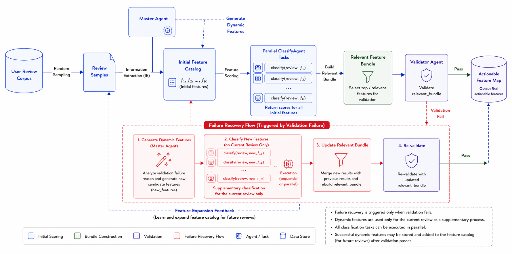

# EchoInsight V2: LLM-Driven Review-to-Feature Mapping

EchoInsight V2 is a review analysis system that converts customer reviews into a structured feature map with LLM agents.

At a high level, the pipeline does this:

1. Sample reviews from the target dataset.
2. Ask a master agent to initialize a reusable feature catalog.
3. For each `(review, feature)` pair, ask a classification agent whether the feature is relevant to the review and what the sentiment is.
4. Ask a validation agent whether the relevant feature bundle adequately covers the review.
5. If validation fails, ask the master agent for a reusable dynamic feature, classify it for the current review, and validate again.
6. Export feature maps, diagnostics, reports, and summary statistics.

## Workflow Diagram



## What The Project Produces

For each run, EchoInsight V2 writes:

- `feature_map.csv`: review-by-feature table used as the main structured output.
- `feature_scores_detail.json`: detailed per-review feature scores.
- `review_level_diagnostics.jsonl`: one JSON line per review with validation and dynamic-feature details.
- `initialized_feature_corpus.json`: the initial catalog generated before the full loop.
- `final_feature_catalog.json`: the final catalog after any dynamic additions.
- `v2_summary.json`: run-level summary.
- `report.md`: readable run report.
- visualization files such as SVG and HTML summaries when the summarizer runs.

## Repository Layout

```text
api/                    API smoke checks
config/                 model registry and feature config
data/                   input review CSVs
results_v2/             generated pipeline outputs
scripts/                convenience launch/finalize helpers
src/echoinsight/        V2 pipeline implementation
run_v2.py               main CLI entry point
EchoInsight_V2_Demo.ipynb
README.md
```

Important source files:

- `src/echoinsight/v2_pipeline.py`: overall orchestration and output writing.
- `src/echoinsight/master_agent.py`: initial feature extraction and dynamic feature proposals.
- `src/echoinsight/classify_agent.py`: per-pair feature classification.
- `src/echoinsight/validation_agent.py`: feature-bundle coverage validation.
- `src/echoinsight/qwen_api.py`: OpenAI-compatible client used by the agents.
- `config/model_registry.json`: model aliases, RPM, request delays, thinking settings, and timeouts.

## Environment

On the local machine:

```bash
conda activate base
```

On the Rice cluster:

```bash
conda activate /scratch/rl182/envs/echoinsight
```

The project expects Python 3.9+ and the libraries already used by this repo, especially `requests` and `openai`.

## API Credential Files

Credential files are intentionally kept local and should not be committed.

Examples:

For Zhipu BigModel:

```text
apikey = YOUR_ZHIPU_API_KEY
model = glm-4.7
base_url = https://open.bigmodel.cn/api/paas/v4
```

For Volcengine Ark:

```text
apikey = YOUR_API_KEY
model = glm-4-7-251222
base_url = https://ark.cn-beijing.volces.com/api/v3
```

For ModelScope:

```text
apikey = YOUR_MODELSCOPE_TOKEN
model = deepseek-ai/DeepSeek-R1-Distill-Qwen-7B
base_url = https://api-inference.modelscope.cn/v1
```

Model aliases live in `config/model_registry.json`.

To inspect the aliases:

```bash
python run_v2.py --list-models
```

## Recommended Demo: Jupyter Notebook

The clearest way to demo the system is the notebook:

- `EchoInsight_V2_Demo.ipynb`

The notebook is designed to:

1. set the project root and Python executable,
2. configure the local credential file path,
3. run a very small smoke demo on `data/airpod.csv`,
4. inspect `v2_summary.json`,
5. preview the resulting `feature_map.csv`,
6. inspect the initialized feature corpus and a few diagnostic records.

### How To Run The Notebook

1. Open Jupyter Lab, Jupyter Notebook, or VS Code Notebook support in this repository root.
2. Open `EchoInsight_V2_Demo.ipynb`.
3. In the first configuration cell:
   - set `PROJECT_ROOT` to this repository root if needed,
   - set `PYTHON_EXE` to the interpreter you want to use,
   - set `INFO_PATH` to your local credential file,
   - optionally change `MODEL_ALIAS`.
4. Run the cells top to bottom.
5. After the pipeline cell finishes, inspect the summary and feature-map preview cells.

### Demo Run Settings Used In The Notebook

The notebook uses a small smoke configuration by default:

- CSV: `data/airpod.csv`
- reviews: `3`
- init sample size: `3`
- max features: `5`
- classify workers: `1`
- max validation iterations: `2`

This is intentionally small so the demo can finish quickly and safely.

## Equivalent CLI Demo

If you want to run the same demo without the notebook:

```bash
cd "/path/to/comp584EchoInsight"

python run_v2.py \
  --csv data/airpod.csv \
  --info api/infor_zhipu.md \
  --model glm-4.7-zhipu \
  --run-name notebook_demo_airpod \
  --max-reviews 3 \
  --sample-size 3 \
  --max-features 5 \
  --classify-workers 1 \
  --max-validation-iters 2
```

If you use another provider, keep the same structure but change `--info` and `--model`.

## Output Files To Inspect After The Demo

For the example above, look under:

```text
results_v2/notebook_demo_airpod/
```

Most useful files:

- `v2_summary.json`
- `feature_map.csv`
- `initialized_feature_corpus.json`
- `review_level_diagnostics.jsonl`
- `feature_scores_detail.json`
- `report.md`

## Useful Helper Commands

API smoke checks:

```bash
python api/check_glm_api.py --info-path api/infor_zhipu.md
python api/check_modelscope_api.py --text-only --stream --model deepseek-ai/DeepSeek-R1-Distill-Qwen-7B --text "hello"
```

Finalize an existing run without re-calling the LLM:

```bash
python scripts/finalize_existing_run.py --results-dir results_v2/notebook_demo_airpod
```

Regenerate statistics and visual summaries only:

```bash
python scripts/summarize_results.py --results-dir results_v2/notebook_demo_airpod --top-n 25
```

## Main CLI Parameters

| Parameter | Meaning |
|---|---|
| `--csv` | Input CSV path |
| `--info` | Local credential file containing `apikey`, `model`, `base_url` |
| `--model` | Model alias from `config/model_registry.json` |
| `--run-name` | Output directory name under `results_v2/` |
| `--max-reviews` | Number of reviews to process |
| `--sample-size` | Number of reviews sampled for initialization |
| `--max-features` | Cap on the initial feature catalog |
| `--chunk-max-reviews` | Initialization chunk size in reviews |
| `--chunk-max-chars` | Initialization chunk size in characters |
| `--classify-workers` | Parallel feature classifications per review |
| `--max-validation-iters` | Maximum validation passes per review |

## Notes

- Validation is part of the main loop, not a post-processing-only step.
- Dynamic features are global once accepted, so later reviews can use them.
- Earlier reviews are not retroactively reprocessed.
- Use small smoke runs first, especially with hosted APIs.
