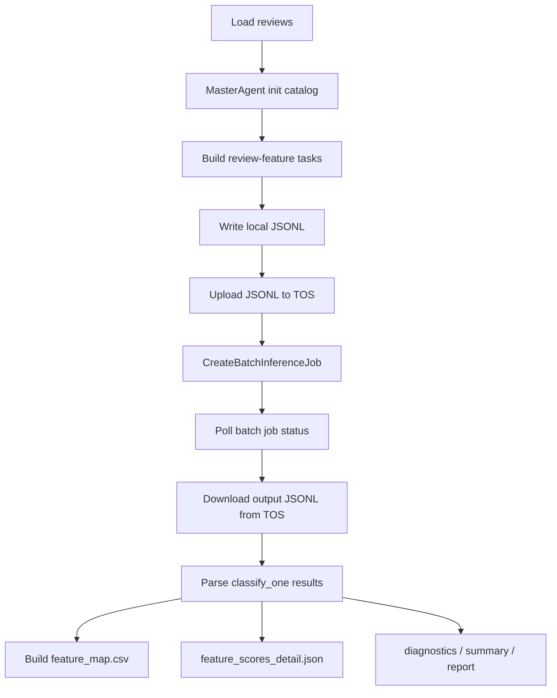

# Volcengine Batch Inference Plan

## Goal

Use Volcengine Ark batch inference to run `ClassifyAgent` at scale.

Current phase-1 classification calls one LLM request for every `(review, feature)` pair. This is clean, but slow for large runs:

```text
total requests = review_count * feature_count
```

Batch inference should keep the same `classify_one` prompt/schema, but submit many pairwise classification requests through `CreateBatchInferenceJob`.

## Info File Naming

Use one local credential naming style:

```text
api/infor_tt.md          # Volcengine Ark / 火山
api/infor_zhipu.md       # Zhipu BigModel
api/infor_modelscope.md  # ModelScope
```

All `infor_*.md` files stay ignored by git.

`api/infor_tt.md` keeps the current OpenAI-compatible runtime fields:

```text
apikey = ...
model = glm-4-7-251222
base_url = https://ark.cn-beijing.volces.com/api/v3
```

For batch inference we will need extra Volcengine/TOS fields. Add them later either to the same file or a separate local file such as `api/infor_tt_batch.md`:

```text
project_name = default
region = cn-beijing
openapi_host = open.volcengineapi.com
tos_bucket = ...
tos_input_prefix = batch-inference-job/dataset/
tos_output_prefix = batch-inference-job/output/
foundation_model_name = glm-4-7-251222
foundation_model_version = ...
completion_window = 1d
batch_max_tasks_per_file = 500
batch_max_input_mb = 50
batch_max_active_jobs = 1
batch_poll_interval_seconds = 60
batch_dry_run_first = true
```

## Parallelism And Safety Settings

`CreateBatchInferenceJob` does not expose a direct `parallelism` or `concurrency` parameter in the create-job request. The create request mainly controls:

- `InputFileTosLocation`
- `OutputDirTosLocation`
- `ModelReference`
- `ProjectName`
- `CompletionWindow`
- `DryRun`

So we should not try to set model-side concurrency directly. To avoid crashing the run or accidentally submitting a huge expensive job, control parallelism from our side with job/file partitioning and conservative defaults.

### Recommended first-run defaults

Use these settings for the first real batch implementation:

```text
batch_max_tasks_per_file = 500
batch_max_input_mb = 50
batch_max_active_jobs = 1
batch_poll_interval_seconds = 60
completion_window = 1d
batch_dry_run_first = true
```

Meaning:

- Submit at most one active batch job at a time.
- Put at most 500 `(review, feature)` requests in one input JSONL.
- Keep each input JSONL under 50 MB.
- Poll job status at most once per minute.
- Always call `CreateBatchInferenceJob` with `DryRun=true` before real submit.
- Use `CompletionWindow=1d` first, because this is offline work and does not need low latency.

### Scaling ladder

Start small and only increase after output parsing is stable:

| Stage | Reviews | Features | Max tasks/file | Active jobs | Purpose |
|---|---:|---:|---:|---:|---|
| dry run | 1 | 2-5 | 10 | 1 | Validate signing, TOS path, request body |
| smoke | 1-2 | 5 | 25 | 1 | Validate real output JSONL parsing |
| small | 5 | 5 | 25 | 1 | Validate summary/report generation |
| medium | 20 | 10 | 200 | 1 | Check cost, latency, failed-row handling |
| max local run | 100 | 20-40 | 500 | 1 | Largest planned project run |

Do not submit multiple active jobs until the parser can resume from an existing job and handle partial failures.

For this project, do not plan beyond 100 reviews. If the catalog has 40 features, the largest expected classify workload is:

```text
100 reviews * 40 features = 4000 batch rows
```

That should be split into shards of at most 500 rows:

```text
4000 rows / 500 rows per shard = 8 batch input files
```

### Why not one huge file

One huge JSONL file is risky because:

- A schema bug repeats across every row.
- A wrong model reference may fail the whole job.
- A bad prompt version can waste a large run.
- Output parsing is harder to debug.
- Re-submission can create cost if the input object key changes.

Prefer deterministic sharded files:

```text
batch-inference-job/dataset/<run_name>/classify_input_<hash>_part000.jsonl
batch-inference-job/dataset/<run_name>/classify_input_<hash>_part001.jsonl
```

### Local online fallback concurrency

If we add a local threaded fallback before real Ark batch mode, keep it separate from batch inference:

```text
online_max_workers = 2
online_requests_per_minute = 30
```

Do not use high local thread counts against `https://ark.cn-beijing.volces.com/api/v3` until rate limits are confirmed. Batch mode should use TOS + `CreateBatchInferenceJob`, not many local simultaneous chat requests.

## Batch Data Flow



## Request Granularity

One JSONL line should represent one `(review, feature)` classification task.

Recommended custom id:

```text
review_id=<review_id>|feature=<feature_name>
```

This id is required so output rows can be joined back to the correct review and feature.

## Input JSONL Shape

Volcengine batch input usually follows an OpenAI-compatible request-per-line pattern. Exact field names must be verified against the batch input file spec, but the planned logical structure is:

```json
{
  "custom_id": "review_id=0|feature=noise_cancellation",
  "method": "POST",
  "url": "/chat/completions",
  "body": {
    "model": "glm-4-7-251222",
    "messages": [
      {
        "role": "user",
        "content": "ClassifyAgent classify_one prompt..."
      }
    ],
    "temperature": 0.1,
    "thinking": {
      "type": "disabled"
    }
  }
}
```

The prompt should be generated by a shared helper in `ClassifyAgent`, so online mode and batch mode cannot drift.

## Proposed Code Changes

### 1. Split prompt construction from API calling

In `src/echoinsight/classify_agent.py`, add:

```python
def build_classify_one_prompt(self, review: dict, feature: dict) -> str:
    ...
```

Then `classify_one()` becomes:

```python
prompt = self.build_classify_one_prompt(review, feature)
result = self.client.chat_json(prompt, temperature=self.temperature)
return self._normalize(result, feature_name)
```

Batch mode uses the same prompt builder.

### 2. Add batch task builder

Create a new module:

```text
src/echoinsight/batch_inference.py
```

Responsibilities:

- Build all `(review, feature)` tasks.
- Write batch input JSONL.
- Store mapping metadata locally.
- Validate `custom_id` uniqueness.

### 3. Add Volcengine batch client

Create:

```text
src/echoinsight/volcengine_batch.py
```

Responsibilities:

- Sign Volcengine OpenAPI requests.
- Call `CreateBatchInferenceJob`.
- Poll job status.
- Download or locate output files in TOS.

The first method to implement:

```python
def create_batch_inference_job(
    name: str,
    input_bucket: str,
    input_object_key: str,
    output_bucket: str,
    output_object_key: str,
    project_name: str = "default",
    completion_window: str = "1d",
    dry_run: bool = False,
) -> str:
    ...
```

This maps to:

```text
Action = CreateBatchInferenceJob
Version = 2024-01-01
Host = open.volcengineapi.com
Service = ark
Region = cn-beijing
```

### 4. Add pipeline mode

Add a CLI switch in `run_v2.py`:

```text
--classify-mode online|batch
```

Default stays `online`.

Batch mode:

1. Run init normally.
2. Build all review-feature JSONL requests.
3. Upload input JSONL to TOS.
4. Submit `CreateBatchInferenceJob`.
5. Wait for output.
6. Parse results and write the same output files as online mode.

### 5. Keep output schema identical

Online and batch mode must both produce:

- `feature_map.csv`
- `feature_scores_detail.json`
- `review_level_diagnostics.jsonl`
- `v2_summary.json`
- `report.md`

This lets scripts and downstream analysis stay unchanged.

## Idempotency Strategy

Volcengine avoids duplicate active jobs when user, project name, bucket, and input object key are identical.

Use deterministic object keys:

```text
batch-inference-job/dataset/<run_name>/classify_input_<hash>.jsonl
```

The hash should include:

- input CSV path or content hash
- review ids included
- feature catalog hash
- model alias/model id
- classify prompt version

If a duplicate submission returns an error containing an active job id:

1. Parse the job id from the error message.
2. Save it to `results_v2/<run_name>/batch_job.json`.
3. Continue by polling that existing job instead of creating a new one.

## Local Files To Write

For each batch run:

```text
results_v2/<run_name>/batch_input.jsonl
results_v2/<run_name>/batch_task_map.json
results_v2/<run_name>/batch_job.json
results_v2/<run_name>/batch_output_raw.jsonl
results_v2/<run_name>/batch_parse_errors.jsonl
```

Do not commit these outputs by default.

## Failure Handling

Handle these cases explicitly:

- DryRun success returns `DryRunOperation` with status 400.
- Input TOS object missing returns `OperationDenied.InputFileTosLocation`.
- Duplicate active job returns an error with existing job id.
- Some JSONL rows fail or return invalid JSON.
- A row returns a feature name different from `custom_id`; normalize back to the expected feature.

## Build Order

1. Rename and document `api/infor_tt.md`.
2. Extract `ClassifyAgent.build_classify_one_prompt()`.
3. Build local batch JSONL without submitting.
4. Parse a fake batch output JSONL into current output schema.
5. Add TOS upload/download.
6. Add signed `CreateBatchInferenceJob`.
7. Add polling and duplicate-job reuse.
8. Add `--classify-mode batch`.
9. Run a tiny dry run, then a 1-review real batch test.

