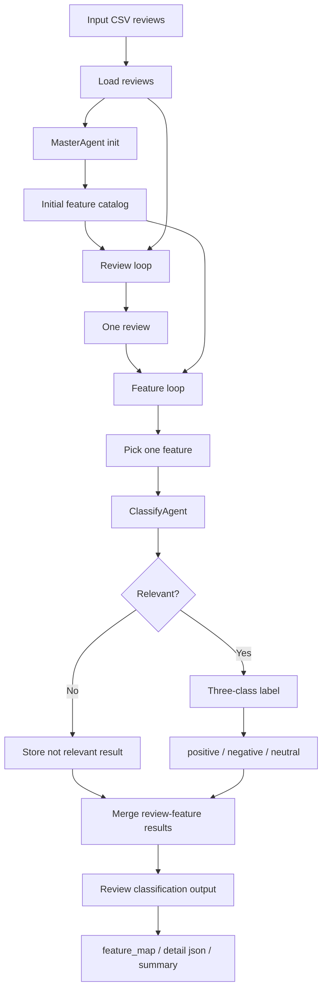

# EchoInsight V2 Modify Plan

## 目标

接下来要调整 V2 的 agent 结构，让职责更清楚：

1. `MasterAgent` 以后主要负责管理 feature。
2. init 之后，每条 review 直接进入 `ClassifyAgent`。
3. `ClassifyAgent` 对每条 review 和所有 features 做逐个分类。

## MasterAgent 新职责

`MasterAgent` 不再负责每条 review 的完整处理流程，而是作为 feature manager 使用。

它主要负责：

1. init feature catalog
   - 从 sampled reviews 中生成初始 feature catalog。
   - 输出可复用的产品级 feature。
   - 保留每个 feature 的 `name`、`description`、`examples`。

2. 管理已有 features
   - 保存当前 feature catalog。
   - 避免重复 feature。
   - 后续可以加入 feature merge、canonicalization、ranking、删除低质量 feature 等逻辑。

3. 分类/处理新的 feature
   - 当系统发现新的 feature candidate 时，由 `MasterAgent` 判断它是否应该进入 catalog。
   - 可以负责判断新 feature 是否和已有 feature 重复。
   - 可以负责把新 feature 归一化成统一格式。

## Init 之后的新流程

init 完成后，系统已经有一个初始 feature catalog。

之后 review 的处理流程变成：

1. 读取一条 review。
2. 把这条 review 直接交给 `ClassifyAgent`。
3. `ClassifyAgent` 遍历当前所有 features。
4. 对每一个 feature，单独跑一次 classify。
5. classify 输出这条 review 和这个 feature 的关系。
6. 所有 feature 都跑完后，汇总成这条 review 的 feature classification result。

## ClassifyAgent 新职责

`ClassifyAgent` 以后负责 review-feature pair 的判断。

输入是一条 review 和一个 feature：

```json
{
  "review_id": "0",
  "review_text": "...",
  "feature": {
    "name": "battery_life",
    "description": "Customer comments about battery duration."
  }
}
```

输出包含两层判断：

1. 相关性判断
   - 判断这个 feature 和当前 review 是否相关。
   - 如果不相关，直接返回 `is_relevant: false`。

2. 三分类判断
   - 如果相关，继续判断 sentiment/category：
     - `positive`
     - `negative`
     - `neutral`

建议输出格式：

```json
{
  "feature": "battery_life",
  "is_relevant": true,
  "label": "positive",
  "confidence": 0.87,
  "evidence_span": "battery lasts all day",
  "reason": "The review explicitly praises the battery duration."
}
```

如果不相关：

```json
{
  "feature": "battery_life",
  "is_relevant": false,
  "label": "neutral",
  "confidence": 0.0,
  "evidence_span": "",
  "reason": "The review does not mention battery life."
}
```

## 新 Data Flow



## 逐 Feature 遍历逻辑

新的 classify 不再一次把所有 features 放进一个 prompt。

而是：

```python
for review in reviews:
    results = []
    for feature in feature_catalog:
        result = classify_agent.classify_one(review, feature)
        results.append(result)
    save_review_results(review, results)
```

也就是说：

- 每条 review 都会跑一次完整 feature loop。
- 每个 feature 都会单独调用一次 `ClassifyAgent`。
- 如果有 100 条 reviews 和 40 个 features，总共会调用 `100 * 40 = 4000` 次 classify。

## 和当前 V2 的区别

当前 V2：

- 一条 review 一次 classify 会把所有 features 一起传给 LLM。
- `ClassifyAgent` 输出每个 feature 的 `has_feature` 和 `feature_score`。
- validation fail 后 `MasterAgent` 会 dynamic generate features。
- dynamic features 会加入当前 review 的本地 feature list，然后下一轮重新 classify。

修改后：

- 一条 review 会遍历所有 features。
- 每次 classify 只判断一个 review-feature pair。
- `ClassifyAgent` 先判断相关不相关。
- 如果相关，再做 `positive / negative / neutral` 三分类。
- `MasterAgent` 专注管理 feature catalog，而不是参与每条 review 的 classify loop。

## 后续可能要改的代码位置

主要会涉及：

- `src/echoinsight/master_agent.py`
  - 保留 init。
  - 增加 feature manager 相关函数。
  - 调整 dynamic/new feature 的管理逻辑。

- `src/echoinsight/classify_agent.py`
  - 从 multi-feature classify 改成 single review-feature pair classify。
  - 新增或替换为 `classify_one(review, feature)`。
  - 输出 `is_relevant` 和 `label`。

- `src/echoinsight/v2_pipeline.py`
  - init 后进入 review loop。
  - 每条 review 内部遍历 feature catalog。
  - 汇总每个 review-feature pair 的结果。
  - 调整输出文件格式。

- `src/echoinsight/feature_fusion.py`
  - 可能不再需要原来的跨 iteration max score fusion。
  - 可以改成 simple aggregation 或 label summary。

- `src/echoinsight/validation_agent.py`
  - 如果新结构暂时不做 dynamic expansion，validation 可以弱化或移除。
  - 如果仍然需要发现 missing feature，则 validation 只负责给 `MasterAgent` 提供 new feature candidates。

## 待确认问题

1. `neutral` 是表示 feature 相关但态度中性，还是也包含不相关？
   - 当前建议：不相关用 `is_relevant: false`，label 默认 `neutral`。
   - 相关但中性用 `is_relevant: true, label: "neutral"`。

2. 新 feature 的发现是否还保留？
   - 如果保留，建议由 `ValidationAgent` 或另一个 detector 提供 candidate，再交给 `MasterAgent` 管理。
   - 如果不保留，整个流程会更简单，只对 init catalog 做分类。

3. 输出的 feature map 如何表示三分类？
   - 可以用 `-1 / 0 / 1`：
     - `positive = 1`
     - `negative = -1`
     - `neutral = 0`
     - not relevant 也可以是空值或 `0`
   - 也可以为每个 feature 输出 string label。
