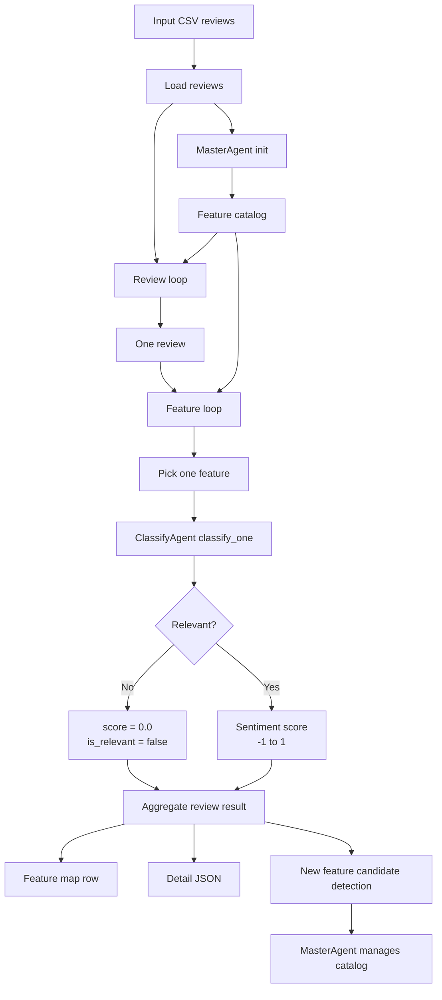

# EchoInsight V2 Build Plan

## Build Tasks

### Task 1: 改 `ClassifyAgent`

目标：把 `ClassifyAgent` 从一次判断多个 features，改成一次只判断一个 review-feature pair。

要做：

1. 在 `src/echoinsight/classify_agent.py` 新增 `classify_one(review, feature)`。
2. prompt 输入一条 review 和一个 feature。
3. 输出固定 JSON dict：

```json
{
  "feature": "noise_cancellation",
  "is_relevant": true,
  "score": 0.65,
  "evidence_span": "noise cancellation works well",
  "reason": "The review positively mentions noise cancellation."
}
```

规则：

- `is_relevant` 表示 review 是否谈到了这个 feature。
- `score` 范围是 `[-1.0, 1.0]`。
- 负数表示 negative。
- 正数表示 positive。
- `0.0` 表示 neutral 或 not relevant。
- 如果 `is_relevant == false`，强制 `score = 0.0`。
- 如果谈到了 feature 但没有明显好坏态度，返回 `is_relevant = true, score = 0.0`。
- `evidence_span` 必须来自 review 原文；不相关时为空字符串。

### Task 2: 改 `v2_pipeline._process_review()`

目标：init 后，每条 review 直接进入 classify；每条 review 遍历所有 features，每个 feature 单独跑一次 `ClassifyAgent`。

新逻辑：

```python
for review in batch:
    feature_results = {}
    for feature in self.master.feature_catalog:
        result = self.classifier.classify_one(review, feature)
        feature_results[result["feature"]] = result
    save_review_result(review, feature_results)
```

需要移除或绕过当前 `_process_review()` 里的：

- per-review iteration loop
- multi-feature classify
- `FeatureFusion`
- `ValidationAgent` pass/fail loop
- 当前 review 内 dynamic feature append 后重新 classify

第一轮 build 先让主流程跑通：

- initial catalog 不变
- 每条 review 跑完整 feature loop
- 输出每个 feature 的 score
- 暂时不让 new feature 影响当前 review 的 feature loop

### Task 3: 改 `feature_map.csv`

目标：从 binary `0/1` feature map 改成 `-1..1` score map。

示例：

| review_id | rating | noise_cancellation | battery_life | fit |
|---|---:|---:|---:|---:|
| 0 | 5.0 | 0.80 | 0.00 | -0.35 |
| 1 | 2.0 | -0.70 | -0.90 | 0.00 |

解释：

- `0.80` 表示 positive。
- `-0.70` 表示 negative。
- `0.00` 可能是 not relevant，也可能是 relevant neutral。
- 具体区别看 detail JSON 里的 `is_relevant`。

### Task 4: 改 `feature_scores_detail.json`

目标：detail JSON 保留完整判断信息，解决 `0.0` 的歧义。

示例：

```json
[
  {
    "review_id": "0",
    "features": {
      "noise_cancellation": {
        "is_relevant": true,
        "score": 0.8,
        "evidence_span": "noise cancellation works well",
        "reason": "The review positively mentions noise cancellation."
      },
      "battery_life": {
        "is_relevant": false,
        "score": 0.0,
        "evidence_span": "",
        "reason": "The review does not mention battery life."
      }
    }
  }
]
```

### Task 5: 改 diagnostics / summary / report

`review_level_diagnostics.jsonl` 建议记录：

- `review_id`
- `features_classified`
- `relevant_features`
- `positive_features`
- `negative_features`
- `neutral_features`
- `new_feature_candidates`
- `elapsed_seconds`
- `agent_timing`

summary 建议统计：

- total reviews
- initial catalog size
- dynamic/new feature candidates count
- average relevant features per review
- positive assignment count
- negative assignment count
- neutral assignment count
- average classify time per review
- average classify time per feature

report 可以展示：

- top positive features
- top negative features
- most frequently relevant features
- new feature candidates

### Task 6: 接回 new feature discovery

新 feature 保留，但建议第二阶段接回。

第一阶段：

- 先跑通 review-feature pair classify。
- new feature candidates 可以先不改变 catalog。

第二阶段：

- classify 完一条 review 后，检测 missing/new feature candidates。
- candidates 交给 `MasterAgent` 管理。
- `MasterAgent` 决定 accept/reject。
- 被接受的新 feature 可以进入后续 review 的 catalog。

## MasterAgent Check

### 第一轮 build 不需要改 `master_agent.py`

检查当前代码后，结论是：第一轮 build 可以暂时不改 `MasterAgent`。

原因：

1. 当前 init 逻辑还能继续用。
   - `sample_reviews()`
   - `extract_initial_features()`
   - `_initial_review_chunks()`
   - `_extract_initial_features_chunk()`
   - `dedupe_features()`

2. pipeline 现在已经直接在 `run()` 里完成 init：
   - 抽样 reviews。
   - 调 `self.master.extract_initial_features(sampled)`。
   - dedupe。
   - cap 到 `max_features`。
   - 写入 `self.master.feature_catalog`。

3. 新 classify flow 只需要读取 `self.master.feature_catalog`。
   - 不需要 `MasterAgent.route_review()`。
   - 不需要 `MasterAgent.generate_dynamic_features()` 参与第一轮主流程。

所以第一轮 build 主要改：

- `src/echoinsight/classify_agent.py`
- `src/echoinsight/v2_pipeline.py`

### 哪些 MasterAgent 函数会暂时不用

新 flow 第一轮里可以不用：

- `route_review()`
  - 旧逻辑用于把 review 包成 multi-feature classify payload。
  - 新逻辑会直接把 `review` 和单个 `feature` 传给 `classify_one()`。

- `generate_dynamic_features()`
  - 旧逻辑用于 validation fail 后给当前 review 动态加 feature。
  - 新逻辑第一阶段先不让 dynamic feature 改变当前 review 的 feature loop。

### 第二轮可能需要改 `MasterAgent`

当我们开始实现 new feature catalog management 时，再改 `MasterAgent`。

建议新增这些能力：

1. `normalize_feature_name(name)`
   - 统一 snake_case。
   - 去掉空格、符号和大小写差异。

2. `is_duplicate_feature(candidate, existing_features)`
   - 判断新 feature 是否和已有 feature 重复。
   - 第一版可以先按 name。
   - 后续可以加 semantic merge。

3. `add_feature_candidate(candidate)`
   - 对 candidate 做校验。
   - accept/reject。
   - 接受后加入 `self.feature_catalog`。

4. `manage_feature_candidates(candidates)`
   - 批量处理 new candidates。
   - 返回 accepted/rejected 结果，方便写 diagnostics。

## 已确认设计决策

### 1. `neutral` 的含义

`neutral` 只表示：feature 和 review 相关，并且 review 确实谈到了这个 feature，但是态度没有明显正向或负向。

例子：

- review 谈到了 `noise_cancellation`
- 但只是描述“有降噪功能”
- 没有说降噪好，也没有说降噪差
- 这种情况是 `neutral`

不相关不属于 `neutral`。

所以新的判断逻辑是：

```text
not relevant:
  review 没有谈到这个 feature

neutral:
  review 谈到了这个 feature
  但是没有明确 positive 或 negative 态度
```

### 2. 新 feature 继续保留

新结构仍然保留 new feature discovery。

职责划分：

- `ClassifyAgent` 只负责 review-feature pair 的相关性和 sentiment score。
- `MasterAgent` 负责管理 feature catalog。
- 如果发现新的 feature candidate，最终由 `MasterAgent` 决定是否加入 catalog。

### 3. Feature map 输出连续分数

新的 `feature_map.csv` 不再做简单分类 label。

每个 feature 输出一个 `-1` 到 `1` 的分数：

```text
-1.0  = 强 negative
 0.0  = neutral 或 not relevant
 1.0  = 强 positive
```

分数方向：

- 负数表示 negative
- 正数表示 positive
- 0 表示 neutral 或 not relevant

detail json 里保留 `is_relevant`，用来区分：

- `is_relevant: false, score: 0.0` -> 没谈到这个 feature
- `is_relevant: true, score: 0.0` -> 谈到了，但态度中性

## 新 Data Flow



## 最小修改范围

第一轮 build 只动：

- `src/echoinsight/classify_agent.py`
- `src/echoinsight/v2_pipeline.py`

暂时不动：

- `src/echoinsight/master_agent.py`
- `src/echoinsight/validation_agent.py`
- `src/echoinsight/feature_fusion.py`

这样做的目的：

- 先让新的 classify data flow 跑通。
- 避免同时改 feature 管理和输出逻辑导致不好验证。
- 第二轮再接 new feature discovery 和 MasterAgent catalog management。
