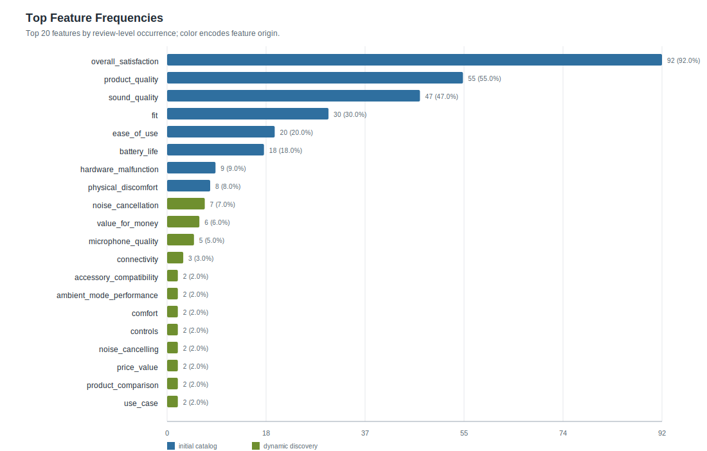
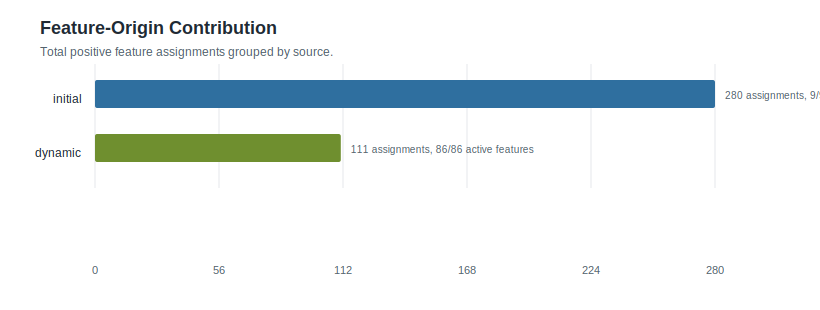
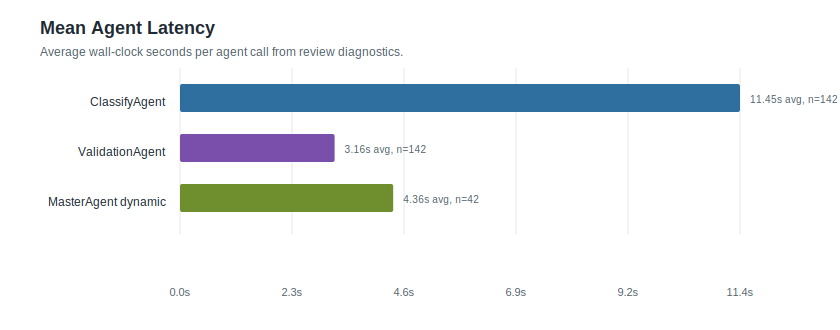
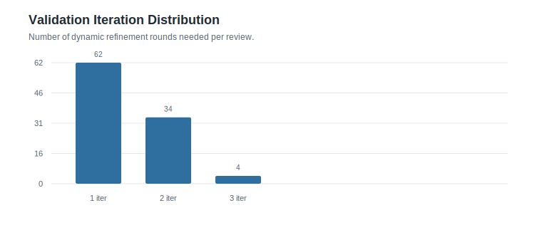

# Feature Statistics: airpod_glm_100

- Reviews processed: 100
- Initial features: 11
- Dynamic features generated: 87
- Features present in feature_map: 95
- Initial features with positive frequency: 9
- Dynamic features with positive frequency: 86

## Visual Summary

- Dashboard: [visual_dashboard.html](visual_dashboard.html)

### Feature Frequency Top20

### Feature Origin Contribution

### Agent Latency Summary

### Iteration Distribution

## Agent Timing Summary

| agent | calls | avg seconds | total seconds | max seconds |
|---|---:|---:|---:|---:|
| ClassifyAgent | 142 | 11.45 | 1625.53 | 28.81 |
| ValidationAgent | 142 | 3.16 | 449.14 | 25.23 |
| MasterAgent dynamic | 42 | 4.36 | 183.13 | 9.49 |
| Review total | 100 | 22.58 | 2257.87 | 85.62 |

## Top Feature Frequencies

| feature | origin | frequency | percentage |
|---|---:|---:|---:|
| `overall_satisfaction` | initial | 92 | 92.0% |
| `product_quality` | initial | 55 | 55.0% |
| `sound_quality` | initial | 47 | 47.0% |
| `fit` | initial | 30 | 30.0% |
| `ease_of_use` | initial | 20 | 20.0% |
| `battery_life` | initial | 18 | 18.0% |
| `hardware_malfunction` | initial | 9 | 9.0% |
| `physical_discomfort` | initial | 8 | 8.0% |
| `noise_cancellation` | dynamic | 7 | 7.0% |
| `value_for_money` | dynamic | 6 | 6.0% |
| `microphone_quality` | dynamic | 5 | 5.0% |
| `connectivity` | dynamic | 3 | 3.0% |
| `accessory_compatibility` | dynamic | 2 | 2.0% |
| `ambient_mode_performance` | dynamic | 2 | 2.0% |
| `comfort` | dynamic | 2 | 2.0% |
| `controls` | dynamic | 2 | 2.0% |
| `noise_cancelling` | dynamic | 2 | 2.0% |
| `price_value` | dynamic | 2 | 2.0% |
| `product_comparison` | dynamic | 2 | 2.0% |
| `use_case` | dynamic | 2 | 2.0% |

## Initial Features

| feature | frequency | percentage |
|---|---:|---:|
| `battery_life` | 18 | 18.0% |
| `ease_of_use` | 20 | 20.0% |
| `fit` | 30 | 30.0% |
| `hardware_malfunction` | 9 | 9.0% |
| `overall_satisfaction` | 92 | 92.0% |
| `overheating` | 0 | 0.0% |
| `physical_discomfort` | 8 | 8.0% |
| `product_quality` | 55 | 55.0% |
| `refund_request` | 1 | 1.0% |
| `sound_quality` | 47 | 47.0% |
| `weight` | 0 | 0.0% |

## Dynamic Features

| feature | frequency | percentage | generated rows |
|---|---:|---:|---:|
| `accessory_compatibility` | 2 | 2.0% | 2 |
| `accessory_quality` | 1 | 1.0% | 1 |
| `accessory_redundancy` | 1 | 1.0% | 1 |
| `ambient_mode` | 1 | 1.0% | 1 |
| `ambient_mode_performance` | 2 | 2.0% | 2 |
| `app_compatibility` | 1 | 1.0% | 1 |
| `audio_recording_quality` | 1 | 1.0% | 1 |
| `authenticity_comparison` | 1 | 1.0% | 1 |
| `automatic_power_management` | 1 | 1.0% | 1 |
| `bass_response` | 1 | 1.0% | 1 |
| `battery_life_comparison` | 1 | 1.0% | 1 |
| `call_quality` | 1 | 1.0% | 1 |
| `case_design` | 1 | 1.0% | 1 |
| `charging_frequency` | 1 | 1.0% | 1 |
| `charging_method_preference` | 1 | 1.0% | 1 |
| `charging_options` | 1 | 1.0% | 1 |
| `charging_speed` | 1 | 1.0% | 1 |
| `cleanliness_condition` | 1 | 1.0% | 1 |
| `comfort` | 2 | 2.0% | 2 |
| `compatibility` | 1 | 1.0% | 1 |
| `connectivity` | 3 | 3.0% | 3 |
| `connectivity_compatibility` | 1 | 1.0% | 1 |
| `connectivity_stability` | 1 | 1.0% | 1 |
| `controls` | 2 | 2.0% | 2 |
| `controls_usability` | 1 | 1.0% | 1 |
| `customer_satisfaction` | 1 | 1.0% | 1 |
| `customizability` | 1 | 1.0% | 1 |
| `design_changes` | 1 | 1.0% | 1 |
| `design_similarity` | 1 | 1.0% | 1 |
| `design_style` | 1 | 1.0% | 1 |
| `discreetness` | 1 | 1.0% | 1 |
| `durability_issues` | 1 | 1.0% | 1 |
| `entertainment_value` | 1 | 1.0% | 1 |
| `feature_expectation` | 1 | 1.0% | 1 |
| `functionality_quality` | 1 | 1.0% | 1 |
| `gaming_suitability` | 1 | 1.0% | 1 |
| `improved_fit` | 1 | 1.0% | 1 |
| `initial_defect` | 1 | 1.0% | 1 |
| `intended_audience` | 1 | 1.0% | 1 |
| `lifestyle_compatibility` | 1 | 1.0% | 1 |
| `logistics_speed` | 1 | 1.0% | 1 |
| `magnetic_attachment` | 1 | 1.0% | 1 |
| `microphone_quality` | 5 | 5.0% | 5 |
| `noise_cancellation` | 7 | 7.0% | 7 |
| `noise_cancellation_adjustability` | 1 | 1.0% | 1 |
| `noise_cancellation_performance` | 1 | 1.0% | 1 |
| `noise_cancelling` | 2 | 2.0% | 2 |
| `noise_cancelling_effectiveness` | 1 | 1.0% | 1 |
| `noise_cancelling_performance` | 1 | 1.0% | 1 |
| `noise_isolation` | 1 | 1.0% | 1 |
| `noise_performance` | 1 | 1.0% | 1 |
| `portability` | 1 | 1.0% | 1 |
| `price` | 1 | 1.0% | 1 |
| `price_affordability` | 1 | 1.0% | 1 |
| `price_value` | 2 | 2.0% | 2 |
| `product_authenticity` | 1 | 1.0% | 1 |
| `product_comparison` | 2 | 2.0% | 2 |
| `product_performance` | 1 | 1.0% | 1 |
| `product_size` | 1 | 1.0% | 1 |
| `promotion` | 1 | 1.0% | 1 |
| `purchase_channel` | 1 | 1.0% | 1 |
| `purchase_confidence` | 1 | 1.0% | 1 |
| `purchase_quantity` | 1 | 1.0% | 1 |
| `replacement_experience` | 1 | 1.0% | 1 |
| `retailer_availability` | 1 | 1.0% | 1 |
| `return_experience` | 1 | 1.0% | 1 |
| `return_process` | 1 | 1.0% | 1 |
| `safety_awareness` | 1 | 1.0% | 1 |
| `situational_awareness` | 1 | 1.0% | 1 |
| `size` | 1 | 1.0% | 1 |
| `size_design` | 1 | 1.0% | 1 |
| `sound_balance` | 1 | 1.0% | 1 |
| `sound_comparison` | 1 | 1.0% | 1 |
| `sound_upgrade_quality` | 1 | 1.0% | 1 |
| `stability` | 1 | 1.0% | 1 |
| `transparency_mode` | 1 | 1.0% | 1 |
| `troubleshooting_experience` | 1 | 1.0% | 1 |
| `upgrade_experience` | 1 | 1.0% | 1 |
| `upgrade_motivation` | 1 | 1.0% | 1 |
| `usage_duration` | 1 | 1.0% | 1 |
| `usage_scenario` | 1 | 1.0% | 1 |
| `use_case` | 2 | 2.0% | 2 |
| `user_happiness` | 1 | 1.0% | 1 |
| `value_for_money` | 6 | 6.0% | 6 |
| `video_chat_performance` | 1 | 1.0% | 1 |
| `voice_assistant_integration` | 1 | 1.0% | 1 |
