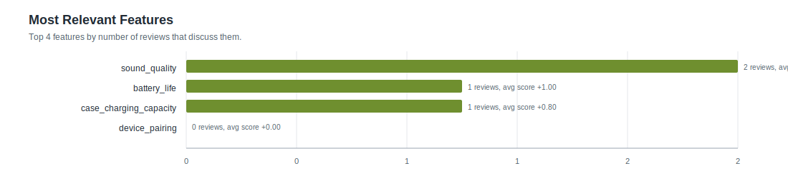

# Feature Statistics: airpod_glm_5

- Reviews processed: 5
- Initial features: 4
- New feature candidates observed: 0
- Features present in feature_map: 4

## Most Relevant Features (plot)

## Agent Timing Summary

| agent | calls | avg seconds | total seconds | max seconds |
|---|---:|---:|---:|---:|
| Review total | 5 | 36.978 | 184.89 | 116.37 |
| ClassifyAgent total per review | 5 | 36.972 | 184.86 | 116.37 |
| ClassifyAgent per feature | 5 | 9.243 | 46.21 | 29.09 |

## Top Features by Relevance

| feature | origin | relevant | pos | neg | neu | avg score (relevant) |
|---|---:|---:|---:|---:|---:|---:|
| `sound_quality` | initial | 2 | 2 | 0 | 0 | +1.000 |
| `battery_life` | initial | 1 | 1 | 0 | 0 | +1.000 |
| `case_charging_capacity` | initial | 1 | 1 | 0 | 0 | +0.800 |
| `device_pairing` | initial | 0 | 0 | 0 | 0 | +0.000 |
