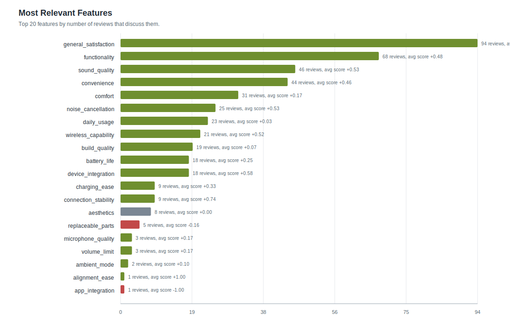
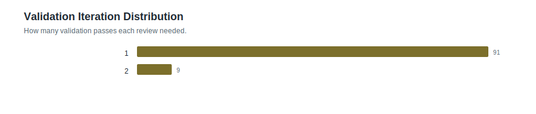
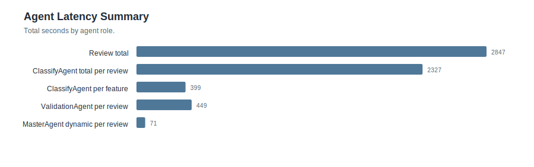
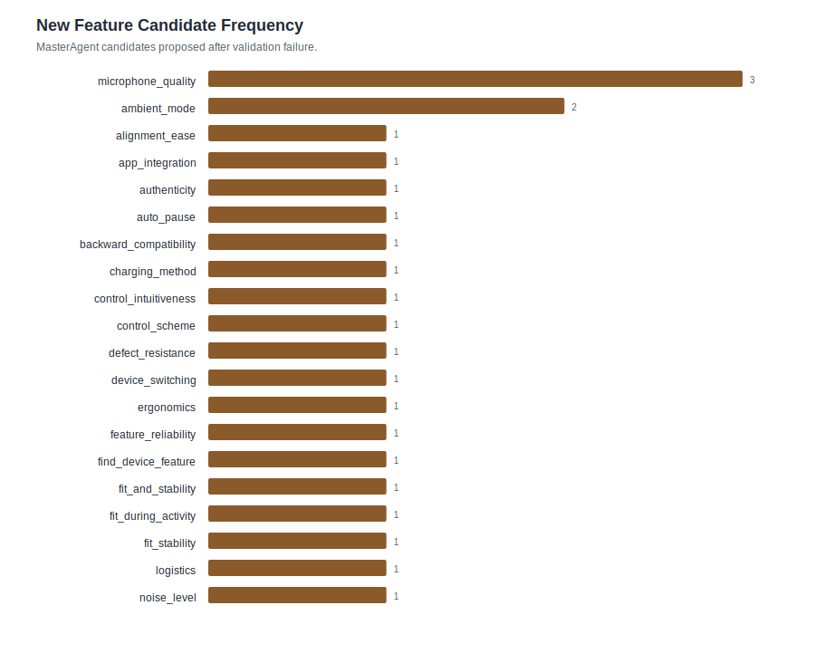
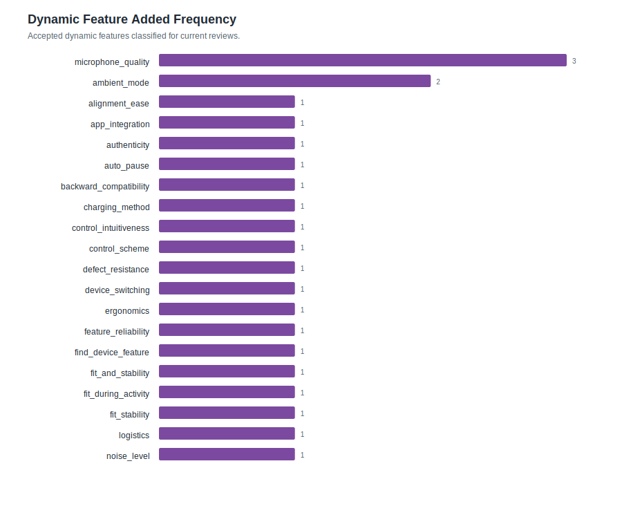

# Feature Statistics: ipad_parallel_100

- Reviews processed: 100
- Initial features: 16
- New feature candidates observed: 25
- Dynamic features added: 25
- Validation pass rate: 0.98
- Validation failed reviews: 2
- Avg validation iterations: 1.09
- Features present in feature_map: 41

## Most Relevant Features (plot)

## Agent Timing Summary

| agent | calls | avg seconds | total seconds | max seconds |
|---|---:|---:|---:|---:|
| Review total | 100 | 28.47 | 2846.99 | 59.12 |
| ClassifyAgent total per review | 100 | 23.273 | 2327.35 | 38.33 |
| ClassifyAgent per feature | 100 | 3.986 | 398.63 | 5.62 |
| ValidationAgent per review | 100 | 4.489 | 448.9 | 14.09 |
| MasterAgent dynamic per review | 100 | 0.707 | 70.74 | 14.08 |

## Validation Visualizations

## Top Features by Relevance

| feature | origin | relevant | pos | neg | neu | avg score (relevant) |
|---|---:|---:|---:|---:|---:|---:|
| `general_satisfaction` | initial | 94 | 77 | 15 | 2 | +0.614 |
| `functionality` | initial | 68 | 47 | 18 | 3 | +0.479 |
| `sound_quality` | initial | 46 | 31 | 9 | 6 | +0.526 |
| `convenience` | initial | 44 | 31 | 9 | 4 | +0.461 |
| `comfort` | initial | 31 | 17 | 12 | 2 | +0.165 |
| `noise_cancellation` | initial | 25 | 17 | 5 | 3 | +0.528 |
| `daily_usage` | initial | 23 | 5 | 5 | 13 | +0.030 |
| `wireless_capability` | initial | 21 | 11 | 0 | 10 | +0.524 |
| `build_quality` | initial | 19 | 8 | 10 | 1 | +0.068 |
| `battery_life` | initial | 18 | 10 | 7 | 1 | +0.250 |
| `device_integration` | initial | 18 | 13 | 2 | 3 | +0.578 |
| `charging_ease` | initial | 9 | 5 | 3 | 1 | +0.333 |
| `connection_stability` | initial | 9 | 8 | 1 | 0 | +0.744 |
| `aesthetics` | initial | 8 | 1 | 1 | 6 | +0.000 |
| `replaceable_parts` | initial | 5 | 0 | 1 | 4 | -0.160 |
| `microphone_quality` | dynamic | 3 | 2 | 1 | 0 | +0.167 |
| `volume_limit` | initial | 3 | 1 | 1 | 1 | +0.167 |
| `ambient_mode` | dynamic | 2 | 1 | 1 | 0 | +0.100 |
| `alignment_ease` | dynamic | 1 | 1 | 0 | 0 | +1.000 |
| `app_integration` | dynamic | 1 | 0 | 1 | 0 | -1.000 |
