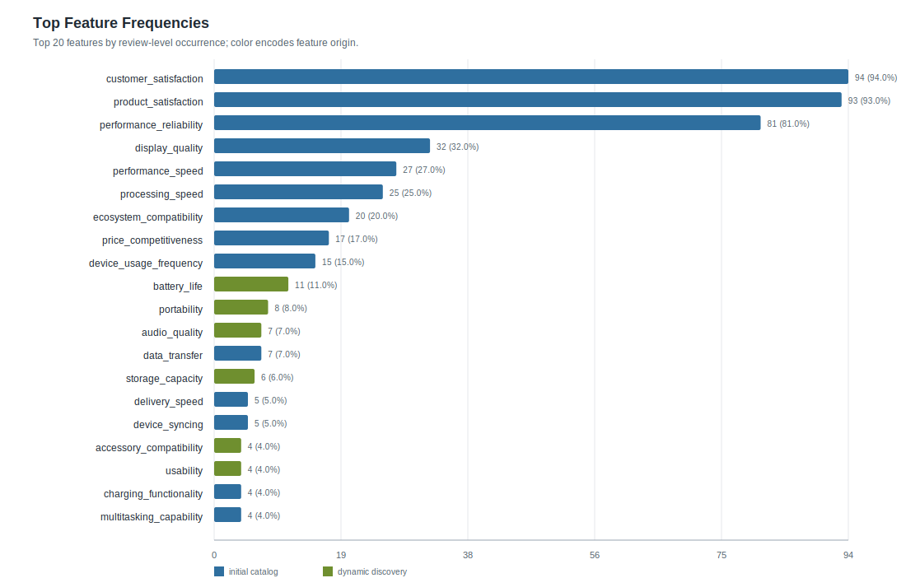
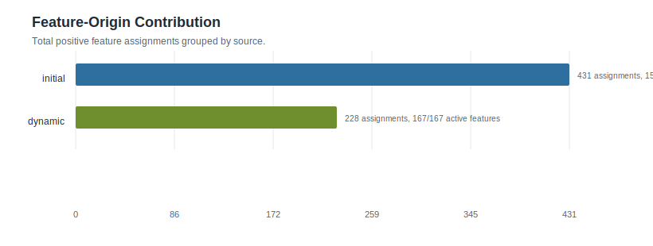
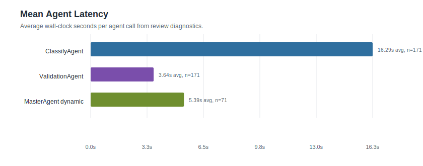
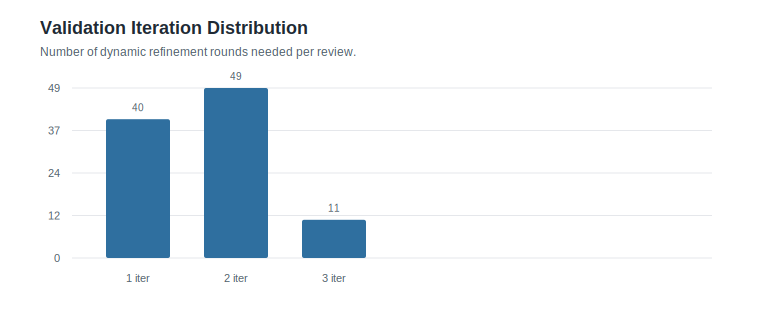

# Feature Statistics: ipad_glm_100

- Reviews processed: 100
- Initial features: 15
- Dynamic features generated: 170
- Features present in feature_map: 182
- Initial features with positive frequency: 15
- Dynamic features with positive frequency: 167

## Visual Summary

- Dashboard: [visual_dashboard.html](visual_dashboard.html)

### Feature Frequency Top20

### Feature Origin Contribution

### Agent Latency Summary

### Iteration Distribution

## Agent Timing Summary

| agent | calls | avg seconds | total seconds | max seconds |
|---|---:|---:|---:|---:|
| ClassifyAgent | 171 | 16.29 | 2785.2 | 137.79 |
| ValidationAgent | 171 | 3.64 | 621.89 | 18.34 |
| MasterAgent dynamic | 71 | 5.39 | 382.45 | 16.98 |
| Review total | 100 | 37.9 | 3789.64 | 163.75 |

## Top Feature Frequencies

| feature | origin | frequency | percentage |
|---|---:|---:|---:|
| `customer_satisfaction` | initial | 94 | 94.0% |
| `product_satisfaction` | initial | 93 | 93.0% |
| `performance_reliability` | initial | 81 | 81.0% |
| `display_quality` | initial | 32 | 32.0% |
| `performance_speed` | initial | 27 | 27.0% |
| `processing_speed` | initial | 25 | 25.0% |
| `ecosystem_compatibility` | initial | 20 | 20.0% |
| `price_competitiveness` | initial | 17 | 17.0% |
| `device_usage_frequency` | initial | 15 | 15.0% |
| `battery_life` | dynamic | 11 | 11.0% |
| `portability` | dynamic | 8 | 8.0% |
| `audio_quality` | dynamic | 7 | 7.0% |
| `data_transfer` | initial | 7 | 7.0% |
| `storage_capacity` | dynamic | 6 | 6.0% |
| `delivery_speed` | initial | 5 | 5.0% |
| `device_syncing` | initial | 5 | 5.0% |
| `accessory_compatibility` | dynamic | 4 | 4.0% |
| `usability` | dynamic | 4 | 4.0% |
| `charging_functionality` | initial | 4 | 4.0% |
| `multitasking_capability` | initial | 4 | 4.0% |

## Initial Features

| feature | frequency | percentage |
|---|---:|---:|
| `charging_functionality` | 4 | 4.0% |
| `customer_satisfaction` | 94 | 94.0% |
| `data_transfer` | 7 | 7.0% |
| `delivery_speed` | 5 | 5.0% |
| `device_syncing` | 5 | 5.0% |
| `device_usage_frequency` | 15 | 15.0% |
| `display_quality` | 32 | 32.0% |
| `ecosystem_compatibility` | 20 | 20.0% |
| `internet_connection_speed` | 2 | 2.0% |
| `multitasking_capability` | 4 | 4.0% |
| `performance_reliability` | 81 | 81.0% |
| `performance_speed` | 27 | 27.0% |
| `price_competitiveness` | 17 | 17.0% |
| `processing_speed` | 25 | 25.0% |
| `product_satisfaction` | 93 | 93.0% |

## Dynamic Features

| feature | frequency | percentage | generated rows |
|---|---:|---:|---:|
| `accessibility_support` | 1 | 1.0% | 1 |
| `accessory_compatibility` | 4 | 4.0% | 4 |
| `accessory_requirement` | 1 | 1.0% | 1 |
| `accessory_requirements` | 1 | 1.0% | 1 |
| `app_availability` | 1 | 1.0% | 1 |
| `app_compatibility` | 1 | 1.0% | 1 |
| `app_ecosystem` | 1 | 1.0% | 1 |
| `app_ecosystem_access` | 1 | 1.0% | 1 |
| `application_usage` | 1 | 1.0% | 1 |
| `audio_device_compatibility` | 1 | 1.0% | 1 |
| `audio_quality` | 7 | 7.0% | 7 |
| `battery_drain_rate` | 1 | 1.0% | 1 |
| `battery_durability` | 1 | 1.0% | 1 |
| `battery_duration` | 1 | 1.0% | 1 |
| `battery_health_maintenance` | 1 | 1.0% | 1 |
| `battery_life` | 11 | 11.0% | 11 |
| `battery_longevity` | 1 | 1.0% | 1 |
| `bezel_design` | 1 | 1.0% | 1 |
| `brand_comparison` | 1 | 1.0% | 1 |
| `brand_reputation` | 1 | 1.0% | 1 |
| `build_quality` | 1 | 1.0% | 1 |
| `camera_placement` | 1 | 1.0% | 1 |
| `camera_quality` | 2 | 2.0% | 2 |
| `case_adjustability` | 1 | 1.0% | 1 |
| `case_functionality` | 1 | 1.0% | 1 |
| `casting_capability` | 1 | 1.0% | 1 |
| `cloud_storage_integration` | 1 | 1.0% | 1 |
| `color_accuracy` | 1 | 1.0% | 1 |
| `color_gamut` | 1 | 1.0% | 1 |
| `color_quality` | 1 | 1.0% | 1 |
| `color_variations` | 1 | 1.0% | 1 |
| `communication_functionality` | 1 | 1.0% | 1 |
| `comparison_preference` | 1 | 1.0% | 1 |
| `comparison_to_other_models` | 1 | 1.0% | 1 |
| `comparison_with_previous_model` | 1 | 1.0% | 1 |
| `compatibility` | 1 | 1.0% | 1 |
| `connectivity_cellular_data` | 1 | 1.0% | 1 |
| `connectivity_stability` | 1 | 1.0% | 1 |
| `creative_input_methods` | 1 | 1.0% | 1 |
| `customer_support_interaction` | 1 | 1.0% | 1 |
| `design_aesthetics` | 2 | 2.0% | 2 |
| `design_change` | 1 | 1.0% | 1 |
| `design_uniqueness` | 2 | 2.0% | 2 |
| `device_comparison` | 1 | 1.0% | 1 |
| `device_weight` | 3 | 3.0% | 3 |
| `display_mode_compatibility` | 1 | 1.0% | 1 |
| `display_size` | 1 | 1.0% | 1 |
| `durability` | 1 | 1.0% | 2 |
| `ease_of_setup` | 2 | 2.0% | 2 |
| `ease_of_use` | 2 | 2.0% | 2 |
| `ergonomics` | 2 | 2.0% | 2 |
| `feature_satisfaction` | 1 | 1.0% | 1 |
| `file_management` | 1 | 1.0% | 1 |
| `fingerprint_sensor_performance` | 1 | 1.0% | 1 |
| `functionality_meets_expectations` | 1 | 1.0% | 1 |
| `future_proofing` | 1 | 1.0% | 1 |
| `future_technology_potential` | 1 | 1.0% | 1 |
| `gaming_performance` | 1 | 1.0% | 1 |
| `gift_recipient` | 1 | 1.0% | 1 |
| `gift_suitability` | 3 | 3.0% | 3 |
| `gps_functionality` | 2 | 2.0% | 2 |
| `hardware_defect` | 1 | 1.0% | 1 |
| `headphone_accessory_requirement` | 1 | 1.0% | 1 |
| `headphone_jack_availability` | 1 | 1.0% | 1 |
| `home_button` | 1 | 1.0% | 1 |
| `input_device_usage` | 1 | 1.0% | 1 |
| `installation_difficulty` | 1 | 1.0% | 1 |
| `keyboard_accessory_quality` | 1 | 1.0% | 1 |
| `keyboard_integration` | 1 | 1.0% | 1 |
| `keyboard_usability` | 1 | 1.0% | 1 |
| `known_issue_resolution` | 1 | 1.0% | 1 |
| `learning_curve` | 1 | 1.0% | 1 |
| `media_consumption` | 1 | 1.0% | 1 |
| `media_consumption_experience` | 1 | 1.0% | 1 |
| `message_integration` | 1 | 1.0% | 1 |
| `missing_features` | 3 | 3.0% | 3 |
| `mounting_compatibility` | 1 | 1.0% | 1 |
| `multitasking_interface` | 1 | 1.0% | 1 |
| `multitasking_usability` | 1 | 1.0% | 1 |
| `operating_system` | 1 | 1.0% | 1 |
| `operating_system_efficiency` | 1 | 1.0% | 1 |
| `operating_system_usability` | 1 | 1.0% | 1 |
| `order_cancellation` | 1 | 1.0% | 1 |
| `order_specification_discrepancy` | 1 | 1.0% | 1 |
| `orientation_preference` | 1 | 1.0% | 1 |
| `orientation_usage` | 1 | 1.0% | 1 |
| `os_update_experience` | 1 | 1.0% | 1 |
| `peripheral_compatibility` | 1 | 1.0% | 1 |
| `physical_dimensions` | 1 | 1.0% | 1 |
| `physical_footprint` | 1 | 1.0% | 1 |
| `physical_size` | 1 | 1.0% | 1 |
| `port_durability` | 1 | 1.0% | 1 |
| `portability` | 8 | 8.0% | 8 |
| `portability_form_factor` | 2 | 2.0% | 2 |
| `portability_size` | 1 | 1.0% | 1 |
| `power_efficiency` | 1 | 1.0% | 1 |
| `pricing_policy` | 1 | 1.0% | 1 |
| `printing_functionality` | 1 | 1.0% | 1 |
| `product_acceptance` | 1 | 1.0% | 1 |
| `product_comparison` | 1 | 1.0% | 1 |
| `product_durability` | 1 | 1.0% | 1 |
| `product_quality` | 1 | 1.0% | 1 |
| `product_size` | 3 | 3.0% | 3 |
| `product_variant_accuracy` | 1 | 1.0% | 1 |
| `product_weight` | 2 | 2.0% | 2 |
| `purchase_decision` | 1 | 1.0% | 1 |
| `purchase_timing_regret` | 1 | 1.0% | 1 |
| `recommendation_suitability` | 1 | 1.0% | 1 |
| `repairability` | 1 | 1.0% | 1 |
| `replacement_need` | 1 | 1.0% | 1 |
| `replacement_upgrade` | 1 | 1.0% | 1 |
| `return_process` | 1 | 1.0% | 1 |
| `screen_rotation_functionality` | 1 | 1.0% | 1 |
| `screen_size` | 1 | 1.0% | 1 |
| `screen_size_comparison` | 1 | 1.0% | 1 |
| `screen_software` | 1 | 1.0% | 1 |
| `screen_visual_quality` | 1 | 1.0% | 1 |
| `scrolling_screen` | 1 | 1.0% | 1 |
| `security_restrictions` | 1 | 1.0% | 1 |
| `seller_communication_responsiveness` | 1 | 1.0% | 1 |
| `seller_politeness` | 1 | 1.0% | 1 |
| `seller_service` | 1 | 1.0% | 1 |
| `setup_complexity` | 1 | 1.0% | 1 |
| `setup_difficulty` | 1 | 1.0% | 1 |
| `shipping_speed` | 1 | 1.0% | 1 |
| `size_comparison` | 1 | 1.0% | 1 |
| `size_preference` | 1 | 1.0% | 1 |
| `sizing_accuracy` | 1 | 1.0% | 1 |
| `software_compatibility` | 3 | 3.0% | 3 |
| `software_learning_curve` | 1 | 1.0% | 1 |
| `software_update_support` | 1 | 1.0% | 1 |
| `sound_quality` | 2 | 2.0% | 2 |
| `speaker_quality` | 1 | 1.0% | 1 |
| `storage_capacity` | 6 | 6.0% | 6 |
| `stylus_compatibility` | 2 | 2.0% | 2 |
| `stylus_performance` | 1 | 1.0% | 1 |
| `stylus_precision` | 1 | 1.0% | 1 |
| `system_fluidity` | 1 | 1.0% | 1 |
| `target_audience` | 1 | 1.0% | 1 |
| `task_limitations` | 1 | 1.0% | 1 |
| `technical_support_quality` | 1 | 1.0% | 1 |
| `touch_interface_responsiveness` | 1 | 1.0% | 1 |
| `touch_sensitivity` | 2 | 2.0% | 2 |
| `touchscreen_quality` | 1 | 1.0% | 1 |
| `touchscreen_responsiveness` | 1 | 1.0% | 1 |
| `trackpad_functionality` | 1 | 1.0% | 1 |
| `upgrade_compatibility` | 2 | 2.0% | 2 |
| `upgrade_value` | 1 | 1.0% | 1 |
| `usability` | 4 | 4.0% | 4 |
| `usage_scenario` | 1 | 1.0% | 1 |
| `usage_scenarios` | 2 | 2.0% | 2 |
| `use_case_meetings` | 1 | 1.0% | 1 |
| `user_control` | 1 | 1.0% | 1 |
| `user_engagement` | 1 | 1.0% | 1 |
| `user_friendliness` | 1 | 1.0% | 1 |
| `user_friendly_interface` | 1 | 1.0% | 1 |
| `user_manual_accessibility` | 1 | 1.0% | 1 |
| `value_for_money` | 3 | 3.0% | 4 |
| `vendor_communication` | 1 | 1.0% | 1 |
| `versatile_usage` | 1 | 1.0% | 1 |
| `versatility` | 1 | 1.0% | 1 |
| `video_playback_issues` | 1 | 1.0% | 1 |
| `virtual_keyboard_usability` | 1 | 1.0% | 1 |
| `waste_generation` | 1 | 1.0% | 1 |
| `weight` | 2 | 2.0% | 2 |
| `weight_portability` | 1 | 1.0% | 1 |
| `workflow_integration` | 1 | 1.0% | 1 |
