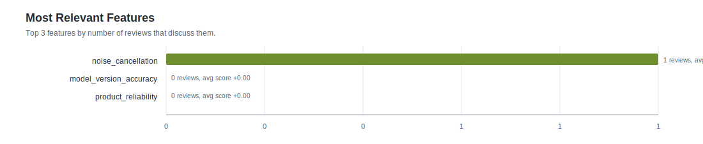

# Feature Statistics: smoke_glm47_zhipu

- Reviews processed: 2
- Initial features: 3
- New feature candidates observed: 0
- Features present in feature_map: 3

## Most Relevant Features (plot)

## Agent Timing Summary

| agent | calls | avg seconds | total seconds | max seconds |
|---|---:|---:|---:|---:|
| Review total | 2 | 15.73 | 31.46 | 21.33 |
| ClassifyAgent total per review | 2 | 15.73 | 31.46 | 21.33 |
| ClassifyAgent per feature | 2 | 5.244 | 10.49 | 7.11 |

## Top Features by Relevance

| feature | origin | relevant | pos | neg | neu | avg score (relevant) |
|---|---:|---:|---:|---:|---:|---:|
| `noise_cancellation` | initial | 1 | 1 | 0 | 0 | +1.000 |
| `model_version_accuracy` | initial | 0 | 0 | 0 | 0 | +0.000 |
| `product_reliability` | initial | 0 | 0 | 0 | 0 | +0.000 |
