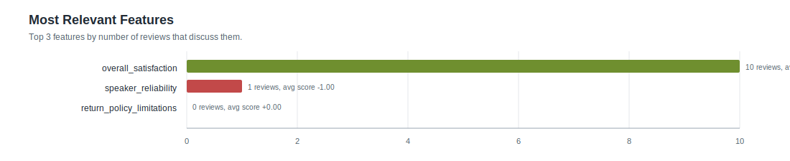

# Feature Statistics: smoke_parallel

- Reviews processed: 10
- Initial features: 3
- New feature candidates observed: 0
- Features present in feature_map: 3

## Most Relevant Features (plot)

## Agent Timing Summary

| agent | calls | avg seconds | total seconds | max seconds |
|---|---:|---:|---:|---:|
| Review total | 10 | 14.521 | 145.21 | 36.58 |
| ClassifyAgent total per review | 0 | 0.0 | 0.0 | 0.0 |
| ClassifyAgent per feature | 10 | 9.31 | 93.1 | 24.94 |

## Top Features by Relevance

| feature | origin | relevant | pos | neg | neu | avg score (relevant) |
|---|---:|---:|---:|---:|---:|---:|
| `overall_satisfaction` | initial | 10 | 9 | 1 | 0 | +0.710 |
| `speaker_reliability` | initial | 1 | 0 | 1 | 0 | -1.000 |
| `return_policy_limitations` | initial | 0 | 0 | 0 | 0 | +0.000 |
