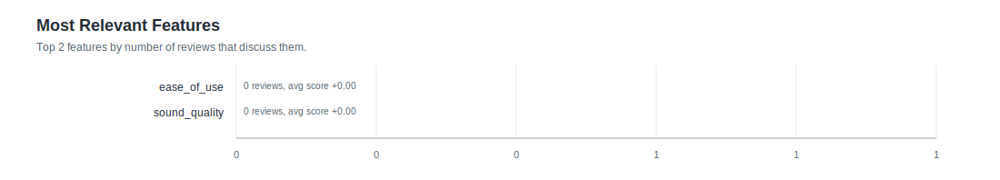

# Feature Statistics: smoke_revert_verify

- Reviews processed: 1
- Initial features: 2
- New feature candidates observed: 0
- Features present in feature_map: 2

## Most Relevant Features (plot)

## Agent Timing Summary

| agent | calls | avg seconds | total seconds | max seconds |
|---|---:|---:|---:|---:|
| Review total | 1 | 4.73 | 4.73 | 4.73 |
| ClassifyAgent total per review | 1 | 4.74 | 4.74 | 4.74 |
| ClassifyAgent per feature | 1 | 2.37 | 2.37 | 2.37 |

## Top Features by Relevance

| feature | origin | relevant | pos | neg | neu | avg score (relevant) |
|---|---:|---:|---:|---:|---:|---:|
| `ease_of_use` | initial | 0 | 0 | 0 | 0 | +0.000 |
| `sound_quality` | initial | 0 | 0 | 0 | 0 | +0.000 |
