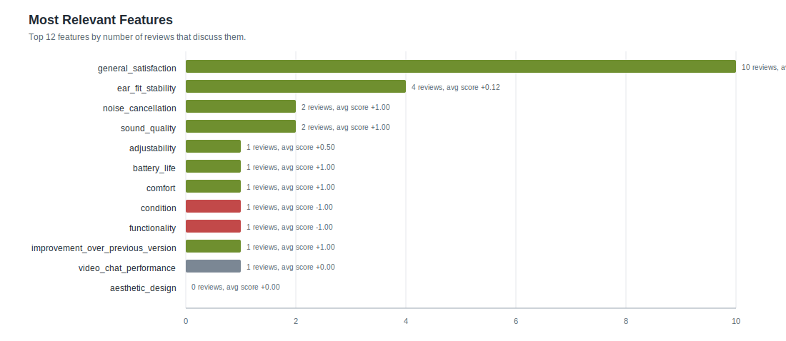
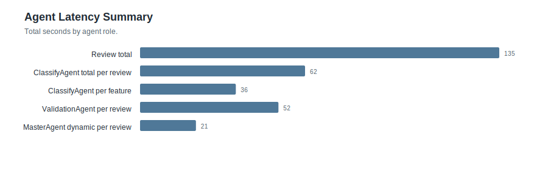
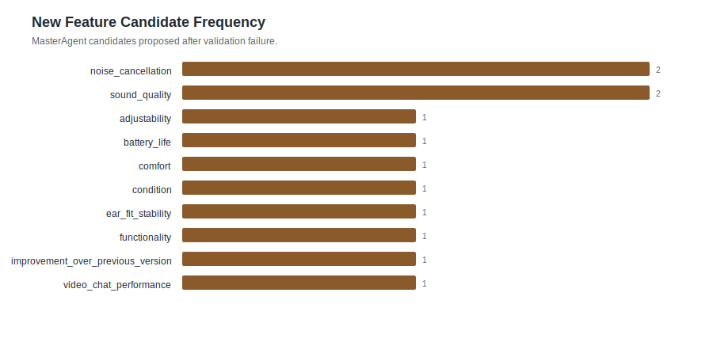
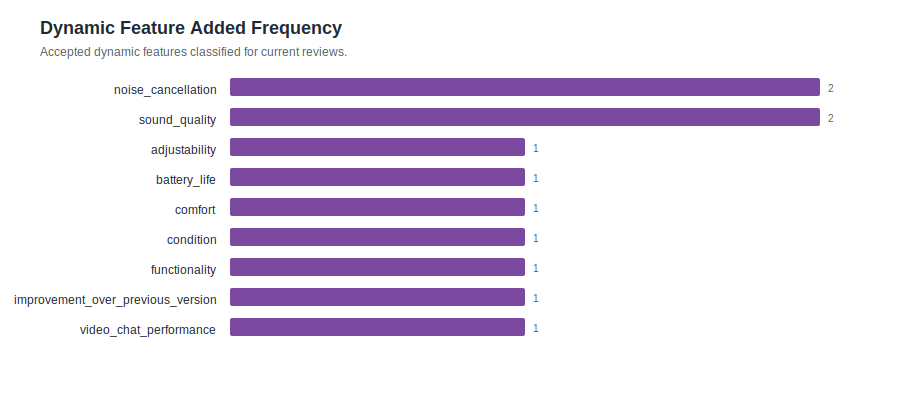

# Feature Statistics: smoke_valid_parallel

- Reviews processed: 10
- Initial features: 3
- New feature candidates observed: 10
- Dynamic features added: 9
- Validation pass rate: 0.9
- Validation failed reviews: 1
- Avg validation iterations: 1.3
- Features present in feature_map: 12

## Most Relevant Features (plot)

## Agent Timing Summary

| agent | calls | avg seconds | total seconds | max seconds |
|---|---:|---:|---:|---:|
| Review total | 10 | 13.456 | 134.56 | 33.76 |
| ClassifyAgent total per review | 10 | 6.166 | 61.66 | 14.5 |
| ClassifyAgent per feature | 10 | 3.566 | 35.66 | 4.42 |
| ValidationAgent per review | 10 | 5.236 | 52.36 | 12.99 |
| MasterAgent dynamic per review | 10 | 2.052 | 20.52 | 11.07 |

## Validation Visualizations

## Top Features by Relevance

| feature | origin | relevant | pos | neg | neu | avg score (relevant) |
|---|---:|---:|---:|---:|---:|---:|
| `general_satisfaction` | initial | 10 | 9 | 1 | 0 | +0.700 |
| `ear_fit_stability` | initial | 4 | 2 | 2 | 0 | +0.125 |
| `noise_cancellation` | dynamic | 2 | 2 | 0 | 0 | +1.000 |
| `sound_quality` | dynamic | 2 | 2 | 0 | 0 | +1.000 |
| `adjustability` | dynamic | 1 | 1 | 0 | 0 | +0.500 |
| `battery_life` | dynamic | 1 | 1 | 0 | 0 | +1.000 |
| `comfort` | dynamic | 1 | 1 | 0 | 0 | +1.000 |
| `condition` | dynamic | 1 | 0 | 1 | 0 | -1.000 |
| `functionality` | dynamic | 1 | 0 | 1 | 0 | -1.000 |
| `improvement_over_previous_version` | dynamic | 1 | 1 | 0 | 0 | +1.000 |
| `video_chat_performance` | dynamic | 1 | 0 | 0 | 1 | +0.000 |
| `aesthetic_design` | initial | 0 | 0 | 0 | 0 | +0.000 |
