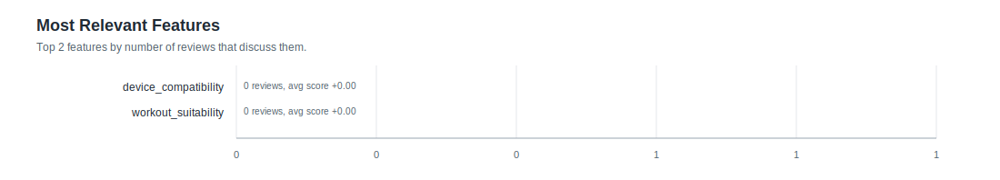
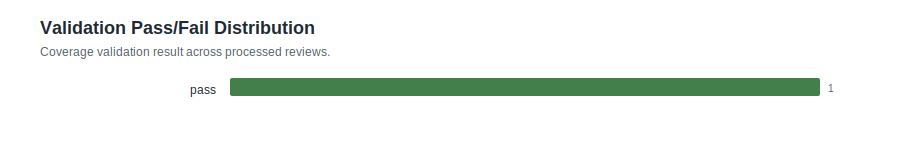
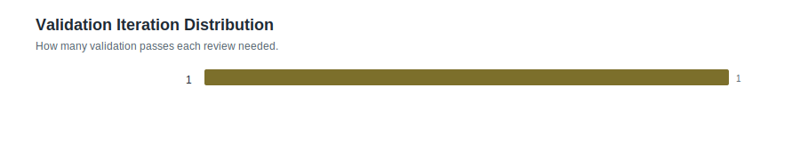
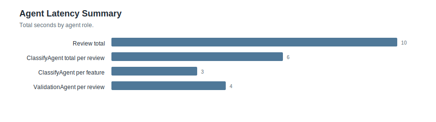

# Feature Statistics: smoke_valid_verify

- Reviews processed: 1
- Initial features: 2
- New feature candidates observed: 0
- Dynamic features added: 0
- Validation pass rate: 1.0
- Validation failed reviews: 0
- Avg validation iterations: 1.0
- Features present in feature_map: 2

## Most Relevant Features (plot)

## Agent Timing Summary

| agent | calls | avg seconds | total seconds | max seconds |
|---|---:|---:|---:|---:|
| Review total | 1 | 10.13 | 10.13 | 10.13 |
| ClassifyAgent total per review | 1 | 5.99 | 5.99 | 5.99 |
| ClassifyAgent per feature | 1 | 3.0 | 3.0 | 3.0 |
| ValidationAgent per review | 1 | 4.13 | 4.13 | 4.13 |
| MasterAgent dynamic per review | 1 | 0.0 | 0.0 | 0.0 |

## Validation Visualizations

## Top Features by Relevance

| feature | origin | relevant | pos | neg | neu | avg score (relevant) |
|---|---:|---:|---:|---:|---:|---:|
| `device_compatibility` | initial | 0 | 0 | 0 | 0 | +0.000 |
| `workout_suitability` | initial | 0 | 0 | 0 | 0 | +0.000 |
