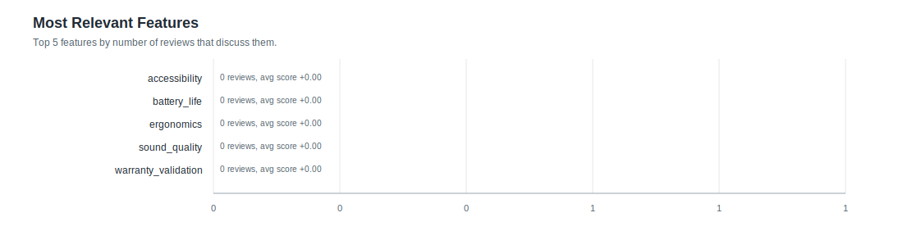

# Feature Statistics: test1_serial

- Reviews processed: 1
- Initial features: 5
- New feature candidates observed: 0
- Features present in feature_map: 5

## Most Relevant Features (plot)

## Agent Timing Summary

| agent | calls | avg seconds | total seconds | max seconds |
|---|---:|---:|---:|---:|
| Review total | 1 | 25.12 | 25.12 | 25.12 |
| ClassifyAgent total per review | 0 | 0.0 | 0.0 | 0.0 |
| ClassifyAgent per feature | 1 | 5.024 | 5.02 | 5.02 |

## Top Features by Relevance

| feature | origin | relevant | pos | neg | neu | avg score (relevant) |
|---|---:|---:|---:|---:|---:|---:|
| `accessibility` | initial | 0 | 0 | 0 | 0 | +0.000 |
| `battery_life` | initial | 0 | 0 | 0 | 0 | +0.000 |
| `ergonomics` | initial | 0 | 0 | 0 | 0 | +0.000 |
| `sound_quality` | initial | 0 | 0 | 0 | 0 | +0.000 |
| `warranty_validation` | initial | 0 | 0 | 0 | 0 | +0.000 |
