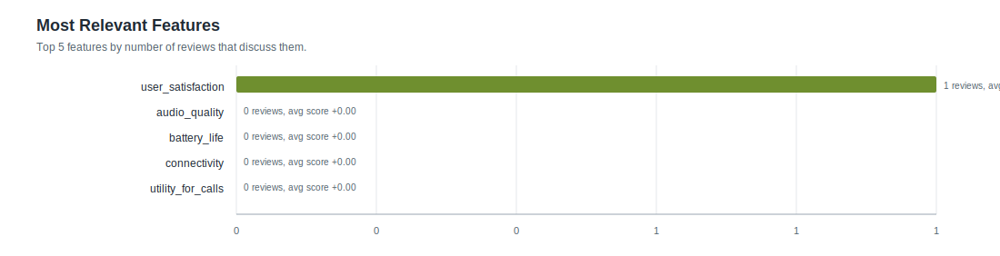

# Feature Statistics: test2_parallel3

- Reviews processed: 1
- Initial features: 5
- New feature candidates observed: 0
- Features present in feature_map: 5

## Most Relevant Features (plot)

## Agent Timing Summary

| agent | calls | avg seconds | total seconds | max seconds |
|---|---:|---:|---:|---:|
| Review total | 1 | 5.9 | 5.9 | 5.9 |
| ClassifyAgent total per review | 0 | 0.0 | 0.0 | 0.0 |
| ClassifyAgent per feature | 1 | 3.11 | 3.11 | 3.11 |

## Top Features by Relevance

| feature | origin | relevant | pos | neg | neu | avg score (relevant) |
|---|---:|---:|---:|---:|---:|---:|
| `user_satisfaction` | initial | 1 | 1 | 0 | 0 | +1.000 |
| `audio_quality` | initial | 0 | 0 | 0 | 0 | +0.000 |
| `battery_life` | initial | 0 | 0 | 0 | 0 | +0.000 |
| `connectivity` | initial | 0 | 0 | 0 | 0 | +0.000 |
| `utility_for_calls` | initial | 0 | 0 | 0 | 0 | +0.000 |
