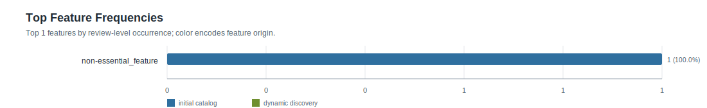
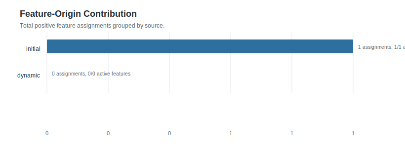
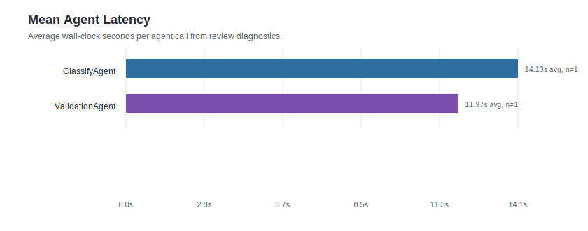
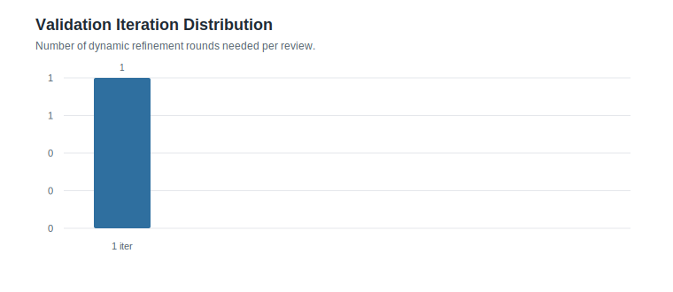

# Feature Statistics: zhipu_smoke_1

- Reviews processed: 1
- Initial features: 4
- Dynamic features generated: 0
- Features present in feature_map: 1
- Initial features with positive frequency: 1
- Dynamic features with positive frequency: 0

## Visual Summary

- Dashboard: [visual_dashboard.html](visual_dashboard.html)

### Feature Frequency Top20

### Feature Origin Contribution

### Agent Latency Summary

### Iteration Distribution

## Agent Timing Summary

| agent | calls | avg seconds | total seconds | max seconds |
|---|---:|---:|---:|---:|
| ClassifyAgent | 1 | 14.13 | 14.13 | 14.13 |
| ValidationAgent | 1 | 11.97 | 11.97 | 11.97 |
| MasterAgent dynamic | 0 | 0.0 | 0.0 | 0.0 |
| Review total | 1 | 26.1 | 26.1 | 26.1 |

## Top Feature Frequencies

| feature | origin | frequency | percentage |
|---|---:|---:|---:|
| `non-essential_feature` | initial | 1 | 100.0% |

## Initial Features

| feature | frequency | percentage |
|---|---:|---:|
| `non-essential_feature` | 1 | 100.0% |
| `pleased_with_purchase` | 0 | 0.0% |
| `sufficient_product` | 0 | 0.0% |
| `upgrade` | 0 | 0.0% |

## Dynamic Features

| feature | frequency | percentage | generated rows |
|---|---:|---:|---:|
