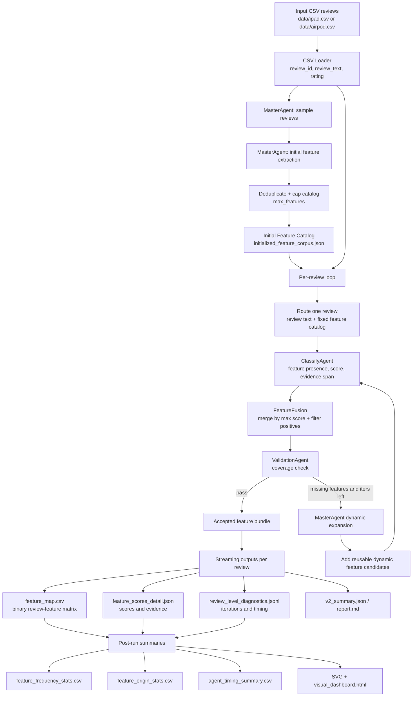

# EchoInsight V2 Architecture Sketch

## 当前模型配置

当前 V2 pipeline 使用 OpenAI-compatible Chat Completions 接口统一接入模型。主要运行路线如下：

- 主实验路线：`glm-4.7-volcengine`
  - 实际模型：`glm-4-7-251222`
  - 服务：Volcengine Ark OpenAI-compatible endpoint
  - 配置：`config/model_registry.json`
  - 本地凭据文件：`api/infor_tt.md`，只用于运行，不应提交密钥
- 备选路线：`deepseek-r1-7b`
  - 实际模型：`deepseek-ai/DeepSeek-R1-Distill-Qwen-7B`
  - 服务：ModelScope OpenAI-compatible endpoint
  - 当前 registry 中默认 alias 是 `deepseek-r1-7b`

所有路线都会关闭 thinking/reasoning 输出，目标是让 LLM 稳定返回 JSON，便于分类、验证和统计。

## 架构草图

## Pipeline 逻辑总结

V2 的核心不是固定手写特征表，而是“初始化特征空间 + 逐条评论动态补全”的 agentic 流程。

1. `MasterAgent` 先从抽样评论中抽取产品级 reusable feature，生成初始 feature catalog。
2. 每条评论进入 `ClassifyAgent`，对当前 catalog 中每个 feature 输出 `has_feature`、`feature_score`、`evidence_span` 和 reason。
3. `FeatureFusion` 保留跨迭代最高分结果，并按 `min_score` 过滤正向 feature。
4. `ValidationAgent` 判断当前正向 feature bundle 是否已经覆盖评论中的主要产品信息。
5. 如果 validation 不通过，`MasterAgent` 根据缺失项生成动态 feature，加入本条评论的 feature list 后重新分类。
6. 每条评论完成后立即刷新 `feature_map.csv`、`feature_scores_detail.json`、`v2_summary.json` 和 diagnostics，降低长跑失败时的数据损失。

## 现在的 Init 流程

当前 init 的目标是从一小批 sampled reviews 里生成一个初始的、产品级可复用 feature catalog。入口在 `EchoInsightV2Pipeline.run()`，主要执行链路如下：

1. `run_v2.py` 创建 `EchoInsightV2Pipeline`，把 `sample_size_init`、`max_features`、`chunk_max_reviews`、`chunk_max_chars` 等参数传进去。
2. `EchoInsightV2Pipeline.__init__()` 根据 `config/model_registry.json` 初始化 `QwenClient`，然后创建 `MasterAgent`、`ClassifyAgent`、`ValidationAgent` 和 `FeatureFusion`。
3. `EchoInsightV2Pipeline.run(csv_path)` 调 `_load_csv()` 读入 CSV，把每条 review 统一成：
   - `review_id`
   - `review_text`
   - `rating`
4. pipeline 调 `self.master.sample_reviews(reviews, self.sample_size_init)`，用 `random.sample()` 从全量 reviews 里随机抽样。抽样结果只用于初始化 feature catalog，不代表后续只处理这些 review。
5. pipeline 调 `self.master.extract_initial_features(sampled)`：
   - 先由 `_initial_review_chunks()` 按 `chunk_max_reviews` 和 `chunk_max_chars` 把 sampled reviews 切 chunk。
   - 每个 chunk 会被编号成 `{ "1": review_text, "2": review_text, ... }` 这种结构。
   - 每个 chunk 调 `_extract_initial_features_chunk(indexed_reviews)`，让 LLM 从这些评论里抽取可复用的产品 review features。
6. `MasterAgent` 的 init prompt 要求 LLM 返回 JSON list，每个 feature 包含：
   - `name`: snake_case feature name
   - `description`: 简短通用描述
   - `examples`: 从 sampled reviews 中原文复制的 1-3 个例子
7. 所有 chunk 的 LLM 输出会合并到 `all_features`，然后调用 `dedupe_features()`。当前 dedupe 只按 lowercase 后的 `name` 去重，不做语义合并，也不处理近义词。
8. pipeline 再次调用 `dedupe_features(raw_features)`，然后截断到 `self.max_features`：
   - `feature_catalog = deduped[: self.max_features]`
   - 如果超过上限，只保留前 `max_features` 个。
9. `self.master.feature_catalog = feature_catalog`，这个 catalog 后面会作为每条 review 的默认 fixed features。
10. init 结果会写入：
    - `initialized_feature_corpus.json`
    - `v2_run_log.json` 里的 `initial_catalog`
    - `v2_summary.json` 里的 `initial_catalog_size`

这个流程的关键结构问题是：初始化 catalog 完全依赖随机抽样和 LLM 输出顺序；去重只按精确 feature name；`max_features` 是简单截断。因此后续如果要改结构，可以优先考虑 sample 策略、chunk 合并策略、semantic canonicalization、feature ranking/capping 这几层。

## 现在的 ClassifyAgent 流程

当前 classify 的目标是：对单条 review 和当前 feature list 做一次多 feature 分类，输出每个 feature 是否出现、分数和证据。它不是单独跑完整闭环，而是在 `_process_review()` 的每一轮 iteration 里被调用。

1. 每条 review 进入 `EchoInsightV2Pipeline._process_review(review)`。
2. 开始时 pipeline 调 `self.master.route_review(review)` 生成初始 payload：
   - `review_id`
   - `review_text`
   - `rating`
   - `default_fixed_features`
3. `default_fixed_features` 来自 `self.master.feature_catalog`，只保留每个 feature 的 `name` 和 `description`。
4. `_process_review()` 里创建 `all_features = list(self.master.feature_catalog)`。这一份 `all_features` 是当前 review 自己的 feature list，后面 dynamic features 只会 append 到这条 review 的本地列表，不会写回全局 initial catalog。
5. pipeline 进入循环：`for iteration in range(1 + self.max_dynamic_iterations)`。
6. 每轮 classify 前，pipeline 都会把当前 `all_features` 重新写进 payload：
   - `payload["default_fixed_features"] = [{"name": ..., "description": ...}, ...]`
7. pipeline 调 `self.classifier.classify(payload)`。
8. `ClassifyAgent.classify()` 从 payload 取：
   - `review_text`
   - `default_fixed_features`
9. `ClassifyAgent` 把 feature list 用 `json.dumps(..., ensure_ascii=False, indent=2)` 塞进 prompt，然后要求 LLM 对每个 feature 返回：
   - `feature`
   - `has_feature`
   - `feature_score`
   - `evidence_span`
   - `reason`
10. classify prompt 的核心规则是：
    - 判断语义，不只看 exact word overlap。
    - 只有明确讨论了该 feature 才标 `has_feature: true`。
    - 如果 `has_feature` 为 false，`feature_score` 必须是 `0.0`。
    - 只返回 JSON list。
11. LLM 返回后，`ClassifyAgent._normalize(raw, features)` 做轻量标准化：
    - 跳过非 dict item。
    - 读取 `feature` 字段作为 name。
    - 把 `feature_score` 转成 float。
    - 把 score clamp 到 `[0.0, 1.0]`。
    - `has_feature = bool(item.get("has_feature", score > 0.5))`。
    - 保留 `evidence_span` 和 `reason`。
12. 这里有一个实现细节：`_normalize()` 里虽然创建了 `feature_names = {f["name"] for f in features}`，但当前没有用它过滤 LLM 返回。因此如果 LLM 返回了 prompt 外的 feature name，现在也可能进入后续结果。
13. `_process_review()` 拿到 outputs 后调用 `self.fusion.fuse(accepted, outputs)`：
    - across iterations 合并同一 review 的分类结果。
    - 当前接受结果保存在 `accepted` dict 里。
14. pipeline 调 `self.fusion.filter_positive(accepted)` 得到 positive bundle，再交给 `ValidationAgent` 检查 coverage。
15. 如果 validation pass，当前 review 结束。
16. 如果 validation fail 且还有 iteration：
    - pipeline 调 `MasterAgent.generate_dynamic_features(review, val_result, all_features)`。
    - 新 dynamic features 如果 name 不在 `all_features` 里，就 append 到 `all_features`。
    - 下一轮 classify 会对 “initial features + 本条 review 的 dynamic features” 重新全量分类。
17. 当前 review 完成后，只把 positive accepted features 写入结果：
    - `feature_map.csv`
    - `feature_scores_detail.json`
    - `review_level_diagnostics.jsonl`

这个流程的关键结构问题是：每轮 classify 都对当前 `all_features` 全量分类；dynamic feature 追加后会让 prompt 越来越长；输出校验很轻；没有 feature routing/top-k recall；也没有把 dynamic feature 先 canonicalize 再进入下一轮。

## 当前 GLM 结果概览

### iPad: `results_v2/ipad_glm_100`

- 处理评论数：100
- Validation pass rate：96.0%
- 平均迭代次数：1.71
- 初始 feature catalog：15 个
- 动态发现 feature：167 个
- 总耗时：3805.7 秒

Top features:

| Feature | Origin | Frequency |
|---|---:|---:|
| `customer_satisfaction` | initial | 94% |
| `product_satisfaction` | initial | 93% |
| `performance_reliability` | initial | 81% |
| `display_quality` | initial | 32% |
| `performance_speed` | initial | 27% |
| `processing_speed` | initial | 25% |
| `ecosystem_compatibility` | initial | 20% |
| `price_competitiveness` | initial | 17% |
| `battery_life` | dynamic | 11% |
| `portability` | dynamic | 8% |

Feature origin contribution:

| Origin | Features present | Positive assignments |
|---|---:|---:|
| initial | 15 | 431 |
| dynamic | 167 | 228 |

Agent timing:

| Agent | Calls | Avg seconds | Total seconds |
|---|---:|---:|---:|
| ClassifyAgent | 171 | 16.29 | 2785.20 |
| ValidationAgent | 171 | 3.64 | 621.89 |
| MasterAgent dynamic | 71 | 5.39 | 382.45 |
| Review total | 100 | 37.90 | 3789.64 |

### AirPods: `results_v2/airpod_glm_100`

- 处理评论数：100
- Validation pass rate：98.0%
- 平均迭代次数：1.42
- 初始 feature catalog：11 个
- 动态发现 feature：86 个
- Review total：2257.87 秒

Top features:

| Feature | Origin | Frequency |
|---|---:|---:|
| `overall_satisfaction` | initial | 92% |
| `product_quality` | initial | 55% |
| `sound_quality` | initial | 47% |
| `fit` | initial | 30% |
| `ease_of_use` | initial | 20% |
| `battery_life` | initial | 18% |
| `hardware_malfunction` | initial | 9% |
| `physical_discomfort` | initial | 8% |
| `noise_cancellation` | dynamic | 7% |
| `value_for_money` | dynamic | 6% |

Feature origin contribution:

| Origin | Features present | Positive assignments |
|---|---:|---:|
| initial | 9 | 280 |
| dynamic | 86 | 111 |

Agent timing:

| Agent | Calls | Avg seconds | Total seconds |
|---|---:|---:|---:|
| ClassifyAgent | 142 | 11.45 | 1625.53 |
| ValidationAgent | 142 | 3.16 | 449.14 |
| MasterAgent dynamic | 42 | 4.36 | 183.13 |
| Review total | 100 | 22.58 | 2257.87 |

## 结果解读

当前 V2 已经能在 100 条评论规模上稳定跑完，并产出可复用的 feature matrix、feature score detail、diagnostics、统计表和 dashboard。GLM 路线在 iPad 与 AirPods 两个产品上 pass rate 都超过 95%，说明“分类 + 验证 + 动态补全”的闭环基本有效。

初始 catalog 负责覆盖高频、通用的产品体验维度，例如满意度、质量、性能、声音、屏幕、价格等。动态 feature 主要补充长尾问题，例如配件兼容、降噪、麦克风、便携性、软件兼容、退货流程、具体硬件缺陷等。

目前最明显的问题是动态 feature 数量偏多，尤其 iPad 100 条中动态 feature 达到 167 个，且存在近义重复，例如 `battery_life`、`battery_duration`、`battery_longevity`，以及 `accessory_requirement`、`accessory_requirements`。这说明 V2 的 recall 较强，但需要在动态 feature 进入 catalog 前增加语义归并或 canonicalization。

性能瓶颈主要在 `ClassifyAgent`。iPad GLM 运行中 `ClassifyAgent` 占 2785.20 秒，远高于 validation 和 dynamic generation。随着 feature catalog 变大，每轮分类 prompt 也会变长，因此后续优化应优先考虑减少分类候选数、做 feature routing，或把动态 feature 合并后再进入下一轮。

## 后续改进方向

- 增加 dynamic feature canonicalization：对新 feature 做 snake_case 规范化、近义合并、单复数合并。
- 增加 feature-level embedding 或 LLM merge step：把动态 feature 汇总成更小的全局 catalog。
- 在 `ClassifyAgent` 前加候选召回：每条评论只分类相关的 top-k features，而不是全量 catalog。
- 对 validation 的 missing feature 输出加约束：避免生成过细、一次性、不可复用的 feature。
- 给结果增加人工审阅层：标注哪些 dynamic feature 应合并、删除或升级为全局固定 feature。
