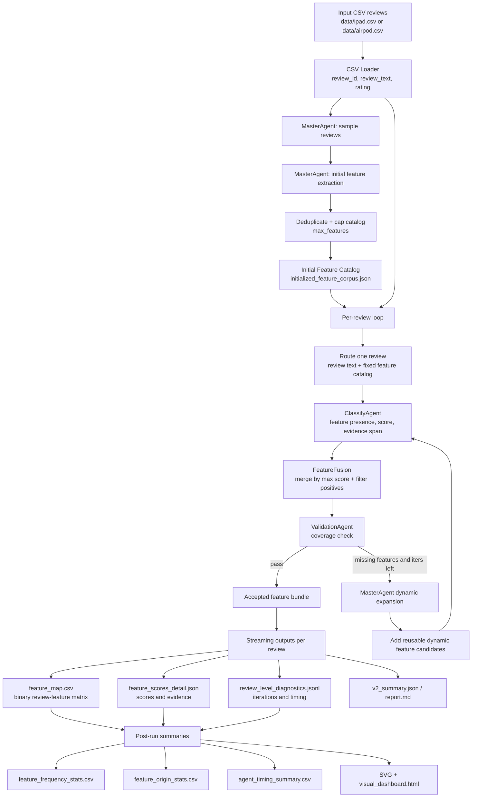

# EchoInsight V2 Architecture Sketch

## 当前模型配置

当前 V2 pipeline 使用 OpenAI-compatible Chat Completions 接口统一接入模型。主要运行路线如下：

- 主实验路线：`glm-4.7-volcengine`
  - 实际模型：`glm-4-7-251222`
  - 服务：Volcengine Ark OpenAI-compatible endpoint
  - 配置：`config/model_registry.json`
  - 本地凭据文件：`api/info_glm.md`，只用于运行，不应提交密钥
- 备选路线：`deepseek-r1-7b`
  - 实际模型：`deepseek-ai/DeepSeek-R1-Distill-Qwen-7B`
  - 服务：ModelScope OpenAI-compatible endpoint
  - 当前 registry 中默认 alias 是 `deepseek-r1-7b`

所有路线都会关闭 thinking/reasoning 输出，目标是让 LLM 稳定返回 JSON，便于分类、验证和统计。

## 架构草图

## Pipeline 逻辑总结

V2 的核心不是固定手写特征表，而是“初始化特征空间 + 逐条评论动态补全”的 agentic 流程。

1. `MasterAgent` 先从抽样评论中抽取产品级 reusable feature，生成初始 feature catalog。
2. 每条评论进入 `ClassifyAgent`，对当前 catalog 中每个 feature 输出 `has_feature`、`feature_score`、`evidence_span` 和 reason。
3. `FeatureFusion` 保留跨迭代最高分结果，并按 `min_score` 过滤正向 feature。
4. `ValidationAgent` 判断当前正向 feature bundle 是否已经覆盖评论中的主要产品信息。
5. 如果 validation 不通过，`MasterAgent` 根据缺失项生成动态 feature，加入本条评论的 feature list 后重新分类。
6. 每条评论完成后立即刷新 `feature_map.csv`、`feature_scores_detail.json`、`v2_summary.json` 和 diagnostics，降低长跑失败时的数据损失。

## 当前 GLM 结果概览

### iPad: `results_v2/ipad_glm_100`

- 处理评论数：100
- Validation pass rate：96.0%
- 平均迭代次数：1.71
- 初始 feature catalog：15 个
- 动态发现 feature：167 个
- 总耗时：3805.7 秒

Top features:

| Feature | Origin | Frequency |
|---|---:|---:|
| `customer_satisfaction` | initial | 94% |
| `product_satisfaction` | initial | 93% |
| `performance_reliability` | initial | 81% |
| `display_quality` | initial | 32% |
| `performance_speed` | initial | 27% |
| `processing_speed` | initial | 25% |
| `ecosystem_compatibility` | initial | 20% |
| `price_competitiveness` | initial | 17% |
| `battery_life` | dynamic | 11% |
| `portability` | dynamic | 8% |

Feature origin contribution:

| Origin | Features present | Positive assignments |
|---|---:|---:|
| initial | 15 | 431 |
| dynamic | 167 | 228 |

Agent timing:

| Agent | Calls | Avg seconds | Total seconds |
|---|---:|---:|---:|
| ClassifyAgent | 171 | 16.29 | 2785.20 |
| ValidationAgent | 171 | 3.64 | 621.89 |
| MasterAgent dynamic | 71 | 5.39 | 382.45 |
| Review total | 100 | 37.90 | 3789.64 |

### AirPods: `results_v2/airpod_glm_100`

- 处理评论数：100
- Validation pass rate：98.0%
- 平均迭代次数：1.42
- 初始 feature catalog：11 个
- 动态发现 feature：86 个
- Review total：2257.87 秒

Top features:

| Feature | Origin | Frequency |
|---|---:|---:|
| `overall_satisfaction` | initial | 92% |
| `product_quality` | initial | 55% |
| `sound_quality` | initial | 47% |
| `fit` | initial | 30% |
| `ease_of_use` | initial | 20% |
| `battery_life` | initial | 18% |
| `hardware_malfunction` | initial | 9% |
| `physical_discomfort` | initial | 8% |
| `noise_cancellation` | dynamic | 7% |
| `value_for_money` | dynamic | 6% |

Feature origin contribution:

| Origin | Features present | Positive assignments |
|---|---:|---:|
| initial | 9 | 280 |
| dynamic | 86 | 111 |

Agent timing:

| Agent | Calls | Avg seconds | Total seconds |
|---|---:|---:|---:|
| ClassifyAgent | 142 | 11.45 | 1625.53 |
| ValidationAgent | 142 | 3.16 | 449.14 |
| MasterAgent dynamic | 42 | 4.36 | 183.13 |
| Review total | 100 | 22.58 | 2257.87 |

## 结果解读

当前 V2 已经能在 100 条评论规模上稳定跑完，并产出可复用的 feature matrix、feature score detail、diagnostics、统计表和 dashboard。GLM 路线在 iPad 与 AirPods 两个产品上 pass rate 都超过 95%，说明“分类 + 验证 + 动态补全”的闭环基本有效。

初始 catalog 负责覆盖高频、通用的产品体验维度，例如满意度、质量、性能、声音、屏幕、价格等。动态 feature 主要补充长尾问题，例如配件兼容、降噪、麦克风、便携性、软件兼容、退货流程、具体硬件缺陷等。

目前最明显的问题是动态 feature 数量偏多，尤其 iPad 100 条中动态 feature 达到 167 个，且存在近义重复，例如 `battery_life`、`battery_duration`、`battery_longevity`，以及 `accessory_requirement`、`accessory_requirements`。这说明 V2 的 recall 较强，但需要在动态 feature 进入 catalog 前增加语义归并或 canonicalization。

性能瓶颈主要在 `ClassifyAgent`。iPad GLM 运行中 `ClassifyAgent` 占 2785.20 秒，远高于 validation 和 dynamic generation。随着 feature catalog 变大，每轮分类 prompt 也会变长，因此后续优化应优先考虑减少分类候选数、做 feature routing，或把动态 feature 合并后再进入下一轮。

## 后续改进方向

- 增加 dynamic feature canonicalization：对新 feature 做 snake_case 规范化、近义合并、单复数合并。
- 增加 feature-level embedding 或 LLM merge step：把动态 feature 汇总成更小的全局 catalog。
- 在 `ClassifyAgent` 前加候选召回：每条评论只分类相关的 top-k features，而不是全量 catalog。
- 对 validation 的 missing feature 输出加约束：避免生成过细、一次性、不可复用的 feature。
- 给结果增加人工审阅层：标注哪些 dynamic feature 应合并、删除或升级为全局固定 feature。
