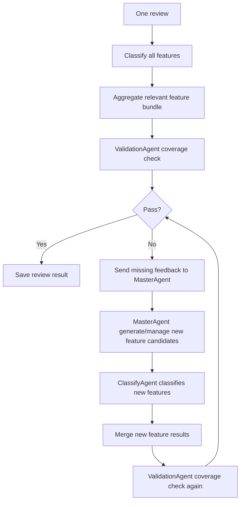

# Validation Build Plan

## Goal

Reconnect `ValidationAgent` to the current phase-1 pipeline and make the full project run end to end:

```text
MasterAgent init
-> per-feature ClassifyAgent classify_one
-> aggregate review feature result
-> ValidationAgent coverage check
-> if validation fails, send feedback to MasterAgent
-> MasterAgent generates/manages new feature candidates
-> ClassifyAgent classifies the new features for the same review
-> ValidationAgent checks coverage again
-> output files
-> summary/report
-> visualization scripts
```

Current code already supports local serial/parallel classify over `(review, feature)` pairs. The missing piece is the validation-driven loop after classification.

Validation is required in the full pipeline. It is not an optional post-processing step.

## Current Problem

`ValidationAgent` exists:

```text
src/echoinsight/validation_agent.py
```

But current `v2_pipeline.py` does not instantiate or call it.

Current review flow:

```text
review
-> classify every feature
-> write relevant/positive/negative/neutral outputs
```

Missing current pieces:

- no `ValidationAgent.validate(...)`
- no validation pass/fail result
- no missing feature feedback
- no MasterAgent new feature candidate generation
- no classify pass for newly generated features
- no second validation after new feature classification
- no visualization/statistics for validation result

## Target Review Flow

For each review:



Important design decision:

**Validation false must trigger another classify pass for newly generated features.**

Why:

- Validation only says coverage is incomplete.
- MasterAgent proposes the missing features.
- ClassifyAgent must still judge whether those new features are relevant to the review.
- ValidationAgent must then re-check the updated relevant bundle.

To avoid runaway loops, use a small iteration cap:

```text
max_validation_iterations = 2 or 3
```

Meaning:

```text
initial classify + validate
if fail:
  generate new features
  classify only new features
  validate again
repeat until pass or max_validation_iterations reached
```

## Validation Input

After classification, build a bundle from relevant features:

```python
relevant_bundle = {
    name: data
    for name, data in features_result.items()
    if data["is_relevant"]
}
```

Validation only checks whether the review's product-related topics are covered by relevant features.

Validation must ignore sentiment direction:

- positive vs negative does not matter
- neutral does not matter
- score magnitude does not matter
- only `is_relevant == true` matters

So validation receives all relevant features and treats them as coverage evidence.

Suggested shape:

```json
{
  "battery_life": {
    "is_relevant": true,
    "score": -0.7,
    "evidence_span": "battery dies quickly",
    "reason": "The review complains about battery duration."
  },
  "noise_cancellation": {
    "is_relevant": true,
    "score": 0.0,
    "evidence_span": "it has noise cancellation",
    "reason": "The review mentions the feature without evaluation."
  }
}
```

## ValidationAgent Changes

File:

```text
src/echoinsight/validation_agent.py
```

Check whether current prompt still says "positive features" or assumes binary `has_feature`.

Update wording to match new schema:

```text
Given the review and the relevant feature bundle, decide whether these relevant features cover the main product-related points in the review.
Do not judge sentiment. Do not care whether a feature is positive, negative, or neutral.
```

Return schema should stay:

```json
{
  "pass": true,
  "missing_features": [],
  "reason": "...",
  "confidence": 0.9
}
```

Rules:

- `pass=true` if the relevant feature bundle covers the main product-related topics.
- `pass=false` if important product-related topics are not represented by any feature.
- `missing_features` should be reusable product-review feature candidates, not one-off phrases.
- Do not require every sentence to be covered.
- Ignore feature sentiment. A negative mention of battery life covers `battery_life` just as well as a positive mention.
- Ignore shipping/order/customer-service issues unless they are part of the product analysis goal.

## Pipeline Changes

File:

```text
src/echoinsight/v2_pipeline.py
```

### 1. Import and instantiate validator

Add:

```python
from .validation_agent import ValidationAgent
```

In `__init__()`:

```python
self.validator = ValidationAgent(self.client, temperature=validation_temperature)
```

Need restore or add parameter:

```python
validation_temperature: float = 0.0
```

### 2. Validate after classification

Validation is mandatory. Do not add `--disable-validation` in the main build.

Inside `_process_review()` after `features_result` is built:

```python
relevant_bundle = {
    name: data
    for name, data in features_result.items()
    if data["is_relevant"]
}

validation_t0 = time.perf_counter()
validation_result = self.validator.validate(review["review_text"], relevant_bundle)
validation_seconds = round(time.perf_counter() - validation_t0, 2)
```

Do not filter by score:

```python
# correct
if data["is_relevant"]:
    include feature in validation bundle

# wrong
if data["score"] > 0:
    include feature in validation bundle
```

### 3. Send validation failure to MasterAgent

If validation returns `pass=false`, the result must go to `MasterAgent`.

This is required because `ValidationAgent` only checks coverage. It should not own feature creation or catalog decisions.

Responsibility split:

```text
ValidationAgent:
  decides whether relevant features cover the review
  returns missing feature feedback if coverage is incomplete

MasterAgent:
  receives validation failure feedback
  generates reusable new feature candidates
  decides whether candidates should be accepted/rejected later
```

### 4. Generate new feature candidates when validation fails

If validation fails:

```python
if validation_result.get("pass") is False:
    candidates = self.master.generate_dynamic_features(
        review,
        validation_result,
        list(self.master.feature_catalog),
    )
```

Loop behavior:

- always send validation failure to `MasterAgent`
- append accepted/usable candidates to the current review's feature list
- classify only the new features, not the whole catalog again
- merge the new classification results into `features_result`
- rebuild relevant bundle
- run `ValidationAgent` again
- repeat until pass or iteration cap

This gives us:

- validation pass rate
- missing feature candidates
- dynamic feature coverage for the current review
- bounded iterative loop

### 5. Iteration algorithm

Per review:

```python
features_result = classify_initial_catalog(review, feature_catalog)
all_features_for_review = list(feature_catalog)
dynamic_features_added = []
validation_iterations = []

for iteration in range(max_validation_iterations):
    relevant_bundle = {
        name: data
        for name, data in features_result.items()
        if data["is_relevant"]
    }

    validation_result = validator.validate(review["review_text"], relevant_bundle)
    validation_iterations.append(validation_result)

    if validation_result["pass"]:
        break

    new_features = master.generate_dynamic_features(
        review,
        validation_result,
        all_features_for_review,
    )

    new_features = master.dedupe_or_filter_new_features(
        new_features,
        all_features_for_review,
    )

    if not new_features:
        break

    new_results = classify_features(review, new_features)
    features_result.update(new_results)
    all_features_for_review.extend(new_features)
    dynamic_features_added.extend([f["name"] for f in new_features])
```

Important:

- Do not re-classify the original initial catalog every iteration.
- Only classify newly generated features.
- Use the same serial/parallel helper for new features.
- Keep the final `features_result` as initial + dynamic classification results.
- The final validation result is the one used for summary/report.

### 6. Dynamic feature scope

First implementation:

- dynamic features are added to the current review result
- dynamic features are recorded in diagnostics
- dynamic features can appear as columns in `feature_map.csv`
- do not automatically mutate global `self.master.feature_catalog` for future reviews unless explicitly enabled later

Reason:

- It keeps per-review dynamic expansion useful.
- It avoids catalog growth causing later reviews to become increasingly expensive.
- Global catalog management can be a separate phase.

### 7. Diagnostics schema

Add fields to each review diagnostics:

```json
{
  "validation_pass": true,
  "validation_reason": "...",
  "validation_confidence": 0.9,
  "missing_features": [],
  "new_feature_candidates": [],
  "dynamic_features_added": [],
  "validation_iterations_used": 1,
  "validation_iteration_detail": [],
  "master_agent_received_validation_failure": false,
  "agent_timing": {
    "classify_total": 12.4,
    "validation_agent": 2.1,
    "master_agent_dynamic": 0.0,
    "classify_workers": 3
  }
}
```

## Output Changes

### `review_level_diagnostics.jsonl`

Must include validation fields:

- `validation_pass`
- `validation_reason`
- `validation_confidence`
- `missing_features`
- `new_feature_candidates`
- `dynamic_features_added`
- `validation_iterations_used`
- `validation_iteration_detail`
- `agent_timing.validation_agent`
- `agent_timing.master_agent_dynamic`

### `v2_summary.json`

Add:

```json
{
  "validation_pass_rate": 0.82,
  "validation_fail_count": 18,
  "avg_validation_iterations": 1.4,
  "avg_validation_seconds_per_review": 2.1,
  "dynamic_new_feature_candidates_count": 25
}
```

### `report.md`

Add section:

```text
## Validation Summary

- Validation enabled: true
- Validation mode: relevant-feature coverage only
- Pass rate: ...
- Failed reviews: ...
- Avg validation iterations: ...
- Common missing feature candidates: ...
```

Per-review section should include:

- validation pass/fail
- missing features
- new candidates

## Visualization Changes

File:

```text
scripts/summarize_results.py
```

Need make sure it can read new diagnostics fields.

Add or restore visualizations:

1. validation pass/fail distribution
2. validation iteration distribution
3. validation pass rate metric in dashboard
4. agent latency including:
   - classify total
   - validation agent
   - master dynamic
5. new feature candidate frequency
6. dynamic feature added frequency

Expected output files:

```text
validation_distribution.svg
validation_iteration_distribution.svg
agent_latency_summary.svg
feature_relevance_top.svg
feature_stats_report.md
visual_dashboard.html
```

If visualization code is currently focused only on classify stats, update it to tolerate validation fields being missing:

```python
validation_pass = diag.get("validation_pass")
```

This keeps old runs readable.

## Run Commands

### Smoke: validation on, serial classify

```powershell
conda run --no-capture-output -n base python -u run_v2.py `
  --csv data/airpod.csv `
  --info api/infor_tt.md `
  --model glm-4.7-volcengine `
  --run-name smoke_valid_serial `
  --max-reviews 2 `
  --sample-size 3 `
  --max-features 5 `
  --classify-workers 1
  --max-validation-iters 2
```

### Smoke: validation on, local parallel classify

```powershell
conda run --no-capture-output -n base python -u run_v2.py `
  --csv data/airpod.csv `
  --info api/infor_tt.md `
  --model glm-4.7-volcengine `
  --run-name smoke_valid_parallel `
  --max-reviews 2 `
  --sample-size 3 `
  --max-features 5 `
  --classify-workers 3
  --max-validation-iters 2
```

### Regenerate visualizations

```powershell
conda run --no-capture-output -n base python -u scripts/summarize_results.py `
  --results-dir results_v2/smoke_valid_parallel
```

## Build Order

1. Update `ValidationAgent` prompt/schema for relevant feature bundle.
2. Instantiate `ValidationAgent` in pipeline.
3. Add validation call after per-feature classify.
4. Add dynamic candidate generation on validation fail.
5. Classify newly generated features.
6. Re-run validation after new feature classification.
7. Add iteration cap with `--max-validation-iters`.
8. Add validation/dynamic iteration fields to diagnostics.
9. Add validation fields to summary/report.
10. Update `scripts/summarize_results.py` to visualize validation and timing.
11. Run serial smoke.
12. Run parallel smoke.
13. Confirm final output files and dashboard.

## Acceptance Criteria

A run is complete when:

- `initialized_feature_corpus.json` exists
- `feature_map.csv` exists
- `feature_scores_detail.json` exists
- `review_level_diagnostics.jsonl` includes validation fields
- `v2_summary.json` includes validation pass rate
- `report.md` includes validation summary
- validation false triggers MasterAgent
- MasterAgent candidates trigger ClassifyAgent classification
- updated bundle goes through ValidationAgent again
- visual files are generated
- `visual_dashboard.html` opens and includes validation/timing sections
- no run crashes when one validation or dynamic generation call fails

## Failure Handling

Validation failure modes should not kill the run.

If `ValidationAgent` errors:

```json
{
  "validation_pass": null,
  "validation_reason": "validation error: ...",
  "missing_features": [],
  "new_feature_candidates": []
}
```

If `MasterAgent.generate_dynamic_features()` errors:

```json
{
  "new_feature_candidates": [],
  "dynamic_error": "..."
}
```

The review should still be written to outputs.

## Important Note

This plan reconnects validation as a post-classify coverage check.

Validation is mandatory and only checks relevant-feature coverage.

It must not use positive/negative sentiment to decide coverage.

When validation returns false, the failure must be passed to `MasterAgent`.

This plan restores a bounded iterative loop:

```text
classify initial features
-> validate
-> if false, MasterAgent generates new features
-> ClassifyAgent classifies new features
-> validate again
```

The loop must be capped by `max_validation_iterations` to avoid runaway cost.
